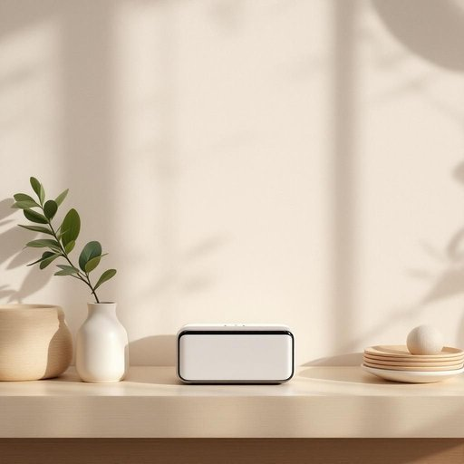

# gadget

<h1 style="font-size: 2.5em; font-weight: 300; letter-spacing: 2px; margin: 0; color: #2c3e50;">
/ˈgæʤət/
</h1>

---

---

## 例句

The innovative gadget, designed with cutting-edge technology and user-friendly features, revolutionizes the way we interact with everyday devices by seamlessly integrating functionality and style into a compact form.

*The(/ðə/) innovative(/ˈɪnəˌveɪtɪv/) gadget,(/ˈgæʤət,/) designed(/dɪˈzaɪnd/) with(/wɪθ/) cutting-edge(/ˈkətɪˌŋɛʤ/) technology(/tɛkˈnɑləʤi/) and(/ənd/) user-friendly(/user-friendly*/) features,(/ˈfiʧərz,/) revolutionizes(/revolutionizes*/) the(/ðə/) way(/weɪ/) we(/wi/) interact(/ˌɪnərˈækt/) with(/wɪθ/) everyday(/ˈɛvriˈdeɪ/) devices(/dɪˈvaɪsɪz/) by(/baɪ/) seamlessly(/ˈsimləsli/) integrating(/ˈɪnəˌgreɪtɪŋ/) functionality(/ˌfəŋkʃəˈnælɪti/) and(/ənd/) style(/staɪl/) into(/ˈɪntu/) a(/ə/) compact(/ˈkɑmpækt/) form.(/fɔrm./)*

**翻译：** 这款创新装置采用前沿技术和人性化设计，巧妙地将功能与时尚融于一体，以紧凑的形态革新了我们与日常设备的互动方式。

---

## 解释

英语单词“gadget”作为名词在家居生活用品的语境中，通常指那些设计巧妙、功能专一且体积较小的实用小装置或工具，比如厨房里的多功能开瓶器、智能家居中的遥控器或便携式充电器等。这类词汇多用于描述日常生活中方便使用、技术含量或设计感较强的电子产品或机械装置，语境多出现于介绍家用电器、生活创新产品或科技新发明时。英语学习者在使用“gadget”时需注意它一般作为可数名词使用，常见搭配有“kitchen gadget”（厨房小工具）、“electronic gadget”（电子设备）、“useful gadget”（实用小器具）等，且不能泛指大件家用电器，而是强调小巧且功能具体的物品。此外，“gadget”在表达上有时带有新颖、便捷甚至略带趣味性的含义，不能随意用来指代所有家居用品。该词的词源可追溯到19世纪末，起初用来指代某种不知其准确名称的小工具或零件，源自英语口语化的用法，带有一种临时替代具体名词的性质，后来演变成指设计巧妙的实用小装置。在中文语境中，“gadget”准确翻译为“小玩意儿”、“小装置”或“小工具”，尤其强调其便捷、创新和现代感，若翻译为“器具”或“设备”则可能过于笼统，失去其特指小巧且富有智能或巧妙设计的特点。此外，“gadget”本身中性偏褒义，暗示该物品实用且有趣，但在某些情况下也可能带有轻微的“花哨”或“不必要”的含义，这取决于具体语境和说话人的态度。总的来说，理解和使用“gadget”需兼顾其功能性、小巧性及现代创新性，在表达家居生活用品时既能体现科技感，又符合日常口语习惯。

---

<small style="color: #999; font-size: 0.9em;">2025-07-27 09:14:04</small>

