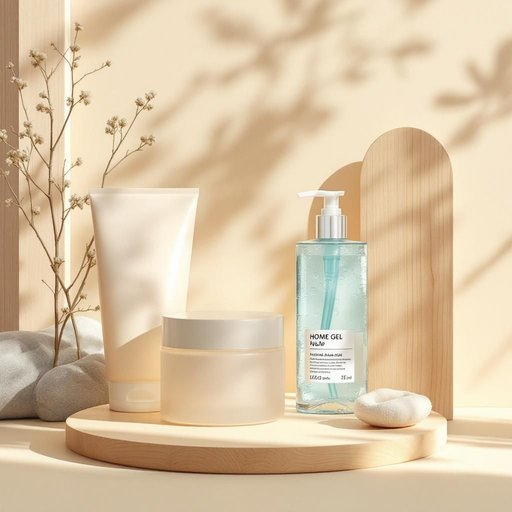

# gel

<h1 style="font-size: 2.5em; font-weight: 300; letter-spacing: 2px; margin: 0; color: #2c3e50;">
/ʤɛl/
</h1>

---

---

## 例句

Could you tell me about the development of the hair gel industry in the last decade, considering how consumer preferences and innovative formulations have influenced market trends globally?

*Could(/kʊd/) you(/ju/) tell(/tɛl/) me(/mi/) about(/əˈbaʊt/) the(/ðə/) development(/dɪˈvɛləpmənt/) of(/əv/) the(/ðə/) hair(/hɛr/) gel(/ʤɛl/) industry(/ˈɪndəstri/) in(/ɪn/) the(/ðə/) last(/læst/) decade,(/ˈdɛkeɪd,/) considering(/kənˈsɪdərɪŋ/) how(/haʊ/) consumer(/kənˈsumər/) preferences(/ˈprɛfərənsɪz/) and(/ənd/) innovative(/ˈɪnəˌveɪtɪv/) formulations(/ˌfɔrmjuˈleɪʃənz/) have(/hæv/) influenced(/ˈɪnfluənst/) market(/ˈmɑrkɪt/) trends(/trɛnz/) globally?(/ˈgloʊbəli?/)*

**翻译：** 过去十年来，发胶行业经历了显著的发展，消费者偏好逐渐从单一的定型功能转向更加注重产品的天然成分、环保性能和多功能性。创新配方不断涌现，加入了保湿、修护、抗热、防紫外线等多重功效，从而提升了产品的使用体验和安全性。这些变化推动了全球市场的多样化发展，促使品牌加大研发投入，推出针对不同发质和使用场景的专属产品，进一步满足消费者个性化和高品质的需求，带动了市场规模的稳步增长。

---

## 解释

gel作为名词在家居生活用品场景中通常指一种呈半固体或胶状的物质，常用于形容各种凝胶类产品，如洗手凝胶、头发造型凝胶、浴室用的香薰凝胶等。具体使用时，通常出现于产品标签、使用说明或日常对话中，如shower gel（沐浴露）或hair gel（发胶），强调其质地和用途。英语学习者在使用gel时应注意它作为不可数名词时表示物质的整体概念，但也可以作为可数名词指具体的凝胶产品或一包凝胶。常见搭配包括gel pack（凝胶包）、gel container（凝胶容器）、gel formula（凝胶配方）等，表达时可用形容词限定质地、用途或香型，如natural gel、cooling gel等。词源方面，gel来源于拉丁语gelare，意为冻结、凝结，在17世纪进入英语，逐渐发展为指代胶状物质。中文语境中，gel翻译为凝胶最为准确，强调其介于液体与固体之间的胶状特性，避免误译为胶水或胶体，以免混淆。此词在家居用品中一般无褒贬色彩，是中性词汇，但因其产品多与美容、清洁相关，常带有清洁、护理、舒适的积极联想。在不同文化背景下，凝胶类产品的受欢迎程度可能影响其使用频率和语义细微差别，但总体上gel作为名词在家居生活用品中具有明确且广泛的应用和理解。

---

<small style="color: #999; font-size: 0.9em;">2025-07-27 09:14:04</small>

