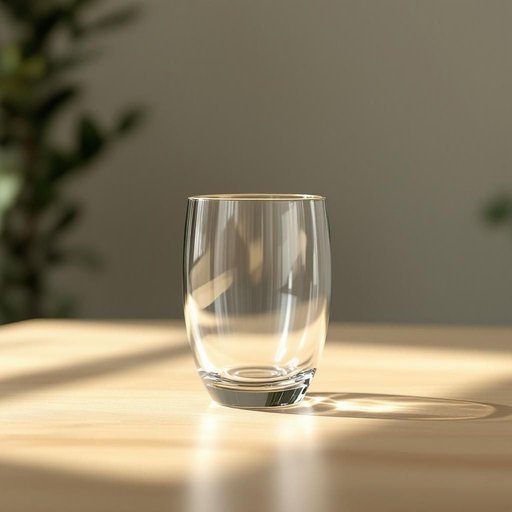

# glass

<h1 style="font-size: 2.5em; font-weight: 300; letter-spacing: 2px; margin: 0; color: #2c3e50;">
/glæs/
</h1>

---

---

## 例句

The glass on the kitchen counter, despite having a tiny chip on its rim, needs to be washed before being placed in the cupboard with the other delicate glassware purchased last Christmas.

*The(/ðə/) glass(/glæs/) on(/ɔn/) the(/ðə/) kitchen(/ˈkɪʧən/) counter,(/ˈkaʊntər,/) despite(/dɪˈspaɪt/) having(/ˈhævɪŋ/) a(/ə/) tiny(/ˈtaɪni/) chip(/ʧɪp/) on(/ɔn/) its(/ɪts/) rim,(/rɪm,/) needs(/nidz/) to(/tɪ/) be(/bi/) washed(/wɑʃt/) before(/ˌbiˈfɔr/) being(/biɪŋ/) placed(/pleɪst/) in(/ɪn/) the(/ðə/) cupboard(/ˈkəbərd/) with(/wɪθ/) the(/ðə/) other(/ˈəðər/) delicate(/ˈdɛləkət/) glassware(/ˈglæsˌwɛr/) purchased(/ˈpərʧəst/) last(/læst/) Christmas.(/ˈkrɪsməs./)*

**翻译：** 厨房台面上的那个玻璃杯，尽管杯口有一个细微的缺口，仍需清洗干净后，方可与去年圣诞节购买的其他精致玻璃器皿一同收纳入橱柜。

---

## 解释

英语单词“glass”在家居生活用品的语境中，作为名词主要指用来盛放饮料的“玻璃杯”或“杯子”，如water glass（喝水的杯子）、wine glass（酒杯）等，具体使用场合多出现在日常饮食、餐桌布置或厨房用品讨论中。英语学习者应注意，“glass”作为不可数名词时指“玻璃材质”本身，如The window is made of glass，而作为可数名词时则指具体的“玻璃杯”，如Please bring me a glass of water。常见搭配包括a glass of（表示“一杯”某种饮料，如a glass of milk），glass door（玻璃门），glass bottle（玻璃瓶）等。词源上，“glass”来源于古英语“glæs”，与德语“Glas”等词同源，原指由特殊熔化材料制成的透明物质，体现其材质属性。在中文语境中，“glass”对应的主要翻译是“玻璃”或“玻璃杯”，需依据具体语境区分，日常对话中多指“杯子”时即为“玻璃杯”的意思。该词中性，无特殊褒贬色彩或文化负载，但在不同场合作为物质或容器指代时需准确理解，以避免歧义。

---

<small style="color: #999; font-size: 0.9em;">2025-07-27 09:14:04</small>

