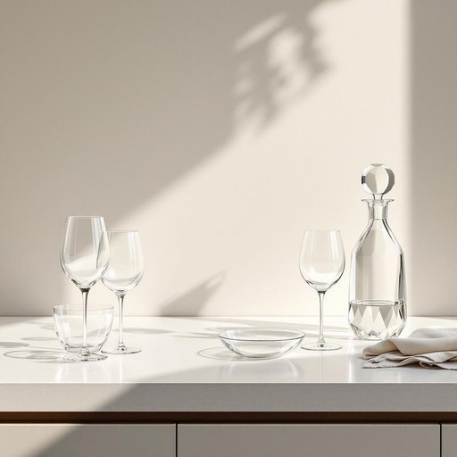

# glassware

<h1 style="font-size: 2.5em; font-weight: 300; letter-spacing: 2px; margin: 0; color: #2c3e50;">
/ˈglæsˌwɛr/
</h1>

---

---

## 例句

Before we host the dinner party next weekend, could you please check the glassware cabinet to ensure all the wine glasses, tumblers, and delicate crystal decanters are clean and free of any chips or cracks, as I want everything to be perfect for our guests?

*Before(/ˌbiˈfɔr/) we(/wi/) host(/hoʊst/) the(/ðə/) dinner(/ˈdɪnər/) party(/ˈpɑrti/) next(/nɛkst/) weekend,(/ˈwiˌkɪnd,/) could(/kʊd/) you(/ju/) please(/pliz/) check(/ʧɛk/) the(/ðə/) glassware(/ˈglæsˌwɛr/) cabinet(/ˈkæbənət/) to(/tɪ/) ensure(/ɪnˈʃʊr/) all(/ɔl/) the(/ðə/) wine(/waɪn/) glasses,(/ˈglæsɪz,/) tumblers,(/ˈtəmblərz,/) and(/ənd/) delicate(/ˈdɛləkət/) crystal(/ˈkrɪstəl/) decanters(/decanters*/) are(/ər/) clean(/klin/) and(/ənd/) free(/fri/) of(/əv/) any(/ˈɛni/) chips(/ʧɪps/) or(/ər/) cracks,(/kræks,/) as(/ɛz/) I(/aɪ/) want(/wɔnt/) everything(/ˈɛvriˌθɪŋ/) to(/tɪ/) be(/bi/) perfect(/ˈpərˌfɪkt/) for(/fər/) our(/ɑr/) guests?(/gɛsts?/)*

**翻译：** 在我们下周末举办晚宴之前，麻烦你检查一下酒具柜，确保所有的葡萄酒杯、威士忌杯以及精致的水晶醒酒器都干净无瑕，没有任何缺口或裂痕，因为我希望一切都能完美无缺地呈现给我们的宾客。

---

## 解释

glassware作为名词在家居生活用品语境中指的是由玻璃制成的各种器皿和用具，如杯子、酒杯、碗、花瓶等，通常用于饮食、装饰或储存等场合。使用时多见于描述厨房用具、餐厅摆设或家居装饰，例如kitchen glassware（厨房玻璃器皿）或fragile glassware（易碎玻璃器皿）。英语学习者在使用该词时需注意它是不可数名词，通常不用复数形式，因为它泛指一类物品，而非单个具体物件；搭配时常见表达包括set of glassware（一套餐具）、delicate glassware（易碎的玻璃器皿）等，且多用于正式或书面语中，口语中则多用具体器皿名称。词源上，glassware由glass（玻璃）和ware（器皿、商品）合成，ware源自古英语waru，意为商品或器具，整体意指玻璃制成的器皿。中文中通常准确翻译为“玻璃器皿”或“玻璃制品”，涵义具体且中性，没有褒贬色彩，强调材质和用途。在文化层面，glassware反映了西方饮食文化中对餐具材质和质感的重视，且在家居布置和待客礼仪中占重要地位。

---

<small style="color: #999; font-size: 0.9em;">2025-07-27 09:14:04</small>

