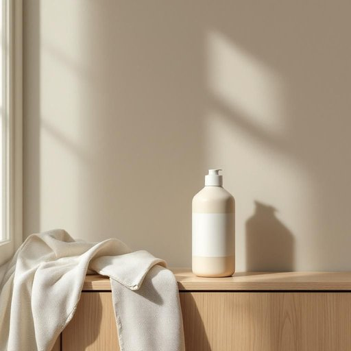

# glue

<h1 style="font-size: 2.5em; font-weight: 300; letter-spacing: 2px; margin: 0; color: #2c3e50;">
/glu/
</h1>

---

---

## 例句

Could you please pass me the glue that’s on the bottom shelf of the cupboard, the one that’s specifically designed for wood and has a stronger bond than the regular all-purpose type, because I need to fix this broken chair leg before it gets any worse?

*Could(/kʊd/) you(/ju/) please(/pliz/) pass(/pæs/) me(/mi/) the(/ðə/) glue(/glu/) that’s(/that’s*/) on(/ɔn/) the(/ðə/) bottom(/ˈbɑtəm/) shelf(/ʃɛlf/) of(/əv/) the(/ðə/) cupboard,(/ˈkəbərd,/) the(/ðə/) one(/wən/) that’s(/that’s*/) specifically(/spəˈsɪfɪkli/) designed(/dɪˈzaɪnd/) for(/fər/) wood(/wʊd/) and(/ənd/) has(/həz/) a(/ə/) stronger(/ˈstrɔŋgər/) bond(/bɑnd/) than(/ðən/) the(/ðə/) regular(/ˈrɛgjələr/) all-purpose(/ˈɔlˈpərpəs/) type,(/taɪp,/) because(/bɪˈkəz/) I(/aɪ/) need(/nid/) to(/tɪ/) fix(/fɪks/) this(/ðɪs/) broken(/ˈbroʊkən/) chair(/ʧɛr/) leg(/lɛg/) before(/ˌbiˈfɔr/) it(/ɪt/) gets(/gɪts/) any(/ˈɛni/) worse?(/wərs?/)*

**翻译：** 你能把橱柜底层架子上的胶水递给我吗？那种专门用于木材、粘合力比普通多用途胶水更强的，因为我需要在这把椅子腿坏得更严重之前修好它。

---

## 解释

英语单词“glue”作为名词，在家居生活用品的语境中主要指用来粘合物体的胶水或粘合剂，常见于修补家具、纸张、木材等材料的场合，具体使用时多指液态或胶状的黏合物。英语学习者使用“glue”时需注意其作为不可数名词时通常指胶水的整体物质，而作为可数名词时可指具体的一瓶胶水（a glue），常见搭配有“white glue”（白胶）、“super glue”（超级胶）、“school glue”（学生用胶）等，表达时可用“apply glue”（涂胶）、“use glue to fix”（用胶水修理）等结构。此外，“glue”还可用作动词，意为“粘合”，但这里重点为名词用法。词源上，“glue”源自中古英语“glew”，进一步追溯至拉丁语“gluten”，意为“粘合物”，反映其本质为一种将物体粘合起来的物质。在中文语境中，“glue”准确翻译为“胶水”或“胶”，强调其作为家居日常中常用的粘合工具。该词通常无褒贬含义，属于中性词汇，使用时仅需注意根据具体语境选择合适的译法和搭配，以准确表达其物理属性和用途，没有特殊文化内涵或特殊语言色彩。

---

<small style="color: #999; font-size: 0.9em;">2025-07-27 09:14:04</small>

