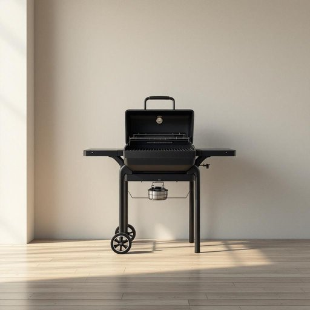

# grill

<h1 style="font-size: 2.5em; font-weight: 300; letter-spacing: 2px; margin: 0; color: #2c3e50;">
/grɪl/
</h1>

---

---

## 例句

I left the chicken marinating for hours, so when we finally fired up the grill in the garden, which has those adjustable racks and a built-in thermometer, it cooked evenly and gave the meat that perfect smoky flavour we always enjoy during our weekend barbecues.

*I(/aɪ/) left(/lɛft/) the(/ðə/) chicken(/ˈʧɪkən/) marinating(/ˈmɛrəˌneɪtɪŋ/) for(/fər/) hours,(/aʊərz,/) so(/soʊ/) when(/wɪn/) we(/wi/) finally(/ˈfaɪnəli/) fired(/faɪərd/) up(/əp/) the(/ðə/) grill(/grɪl/) in(/ɪn/) the(/ðə/) garden,(/ˈgɑrdən,/) which(/wɪʧ/) has(/həz/) those(/ðoʊz/) adjustable(/əˈʤəstəbəl/) racks(/ræks/) and(/ənd/) a(/ə/) built-in(/ˈbɪlˌtɪn/) thermometer,(/θərˈmɑmətər,/) it(/ɪt/) cooked(/kʊkt/) evenly(/ˈivənli/) and(/ənd/) gave(/geɪv/) the(/ðə/) meat(/mit/) that(/ðət/) perfect(/ˈpərˌfɪkt/) smoky(/sˈmoʊki/) flavour(/flavour*/) we(/wi/) always(/ˈɔlˌweɪz/) enjoy(/ˌɛnˈʤɔɪ/) during(/ˈdʊrɪŋ/) our(/ɑr/) weekend(/ˈwiˌkɪnd/) barbecues.(/ˈbɑrbɪˌkjuz./)*

**翻译：** 我让鸡肉腌制了好几个小时，所以当我们最终在花园里点燃那台带可调烤架和内置温度计的烤架时，鸡肉受热均匀，散发出我们在周末烧烤时总能享受到的完美烟熏香味。

---

## 解释

英语单词“grill”在家居生活用品的语境中作为名词，通常指用于烹饪的烧烤架或烤盘，具体是指一种带有铁丝网格或金属条的装置，用来放置食物并通过火焰或热源加热烧烤，常见于厨房或户外烧烤场合。学习者在使用“grill”作为名词时需要注意其可数性，一般可以说“a grill”表示一个烧烤架或烹饪器具，也常见复数形式“grills”。常见搭配有“barbecue grill”（烧烤架）、“electric grill”（电烤炉）、“gas grill”（燃气烧烤炉）等，其中动词形式与名词发音相同，但用法不同，动词意为“烧烤、烤制”，需根据句子结构区分。词源方面，“grill”源自中古英语，源于法语“gril”，进而来自拉丁语“craticulum”，意指小格子或格栅，反映其形态特征。该词在中文语境中通常翻译为“烧烤架”、“烤架”或“烤盘”，根据具体器具形态灵活对应，无褒贬色彩，属于中性词汇，反映西方饮食文化中烧烤方式的普及和日常生活中的实用烹饪工具，使用时需注意区分不同类型和功能的烤具名称。

---

<small style="color: #999; font-size: 0.9em;">2025-07-27 09:14:04</small>

