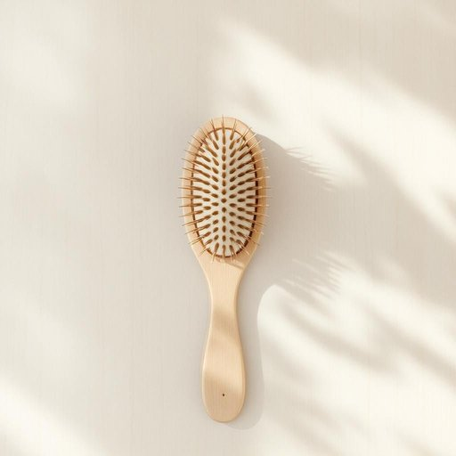

# hairbrush

<h1 style="font-size: 2.5em; font-weight: 300; letter-spacing: 2px; margin: 0; color: #2c3e50;">
/hairbrush*/
</h1>

---

---

## 例句

Before leaving the house this morning, she rummaged through the cluttered bathroom cabinet, hoping to find the hairbrush that her son had borrowed last week, which—despite its unassuming appearance—was essential for smoothing out her unruly curls and keeping them neat throughout the day.

*Before(/ˌbiˈfɔr/) leaving(/ˈlivɪŋ/) the(/ðə/) house(/haʊs/) this(/ðɪs/) morning,(/ˈmɔrnɪŋ,/) she(/ʃi/) rummaged(/ˈrəmɪʤd/) through(/θru/) the(/ðə/) cluttered(/ˈklətərd/) bathroom(/ˈbæθˌrum/) cabinet,(/ˈkæbənət,/) hoping(/ˈhoʊpɪŋ/) to(/tɪ/) find(/faɪnd/) the(/ðə/) hairbrush(/hairbrush*/) that(/ðət/) her(/hər/) son(/sən/) had(/hæd/) borrowed(/ˈbɑˌroʊd/) last(/læst/) week,(/wik,/) which—despite(/which—despite*/) its(/ɪts/) unassuming(/ˌənəˈsumɪŋ/) appearance—was(/appearance—was*/) essential(/ɛˈsɛnʃəl/) for(/fər/) smoothing(/sˈmuðɪŋ/) out(/aʊt/) her(/hər/) unruly(/ənˈruli/) curls(/kərlz/) and(/ənd/) keeping(/ˈkipɪŋ/) them(/ðɛm/) neat(/nit/) throughout(/θruaʊt/) the(/ðə/) day.(/deɪ./)*

**翻译：** 今晨出门前，她翻找着杂乱的浴室柜，想找到上周儿子借走的那把发刷。尽管外表不起眼，那把发刷对她来说却至关重要，能帮她理顺难以驾驭的卷发，使其整齐一整天。

---

## 解释

hairbrush作为名词，指一种用于梳理头发的家居生活用品，通常是带有刷毛的工具，帮助整理、抚平头发，常见于家庭浴室或卧室中，具体使用场合多为日常个人护理和美容环境，比如早晨起床后整理发型或洗发后梳理湿发时，英语学习者需要注意，hairbrush是一个可数名词，通常与冠词连用，如a hairbrush或the hairbrush，且在复数形式时变为hairbrushes，常见搭配包括use a hairbrush（使用梳子）、clean the hairbrush（清洁梳子）、wooden hairbrush（木质梳子）等，此外，hairbrush不同于comb，后者指的是梳子但无刷毛，二者在用途和形态上有区别，词源上，hairbrush由hair（头发）和brush（刷子）两部分构成，字面直译即头发用刷子，起源简单直观，反映了物品的功能属性，中文语境中，hairbrush准确翻译为发刷或梳子，但需注意发刷侧重于带毛刷的梳理工具，与普通梳子区分开来，没有褒贬含义或特别文化内涵，其使用广泛且中性，属于基本的个人生活用品词汇。

---

<small style="color: #999; font-size: 0.9em;">2025-07-27 09:14:04</small>

