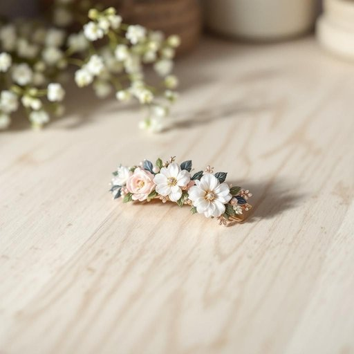

# hairclip

<h1 style="font-size: 2.5em; font-weight: 300; letter-spacing: 2px; margin: 0; color: #2c3e50;">
/hairclip*/
</h1>

---

---

## 例句

Could you please check if the hairclip I left on the kitchen counter, the one with the floral pattern that you said matched your new dress perfectly, is still there before you head out, as I need it to secure my hair while I finish tidying up the living room later?

*Could(/kʊd/) you(/ju/) please(/pliz/) check(/ʧɛk/) if(/ɪf/) the(/ðə/) hairclip(/hairclip*/) I(/aɪ/) left(/lɛft/) on(/ɔn/) the(/ðə/) kitchen(/ˈkɪʧən/) counter,(/ˈkaʊntər,/) the(/ðə/) one(/wən/) with(/wɪθ/) the(/ðə/) floral(/ˈflɔrəl/) pattern(/ˈpætərn/) that(/ðət/) you(/ju/) said(/sɛd/) matched(/mæʧt/) your(/jʊr/) new(/nu/) dress(/drɛs/) perfectly,(/ˈpərfəktli,/) is(/ɪz/) still(/stɪl/) there(/ðɛr/) before(/ˌbiˈfɔr/) you(/ju/) head(/hɛd/) out,(/aʊt,/) as(/ɛz/) I(/aɪ/) need(/nid/) it(/ɪt/) to(/tɪ/) secure(/sɪˈkjʊr/) my(/maɪ/) hair(/hɛr/) while(/waɪl/) I(/aɪ/) finish(/ˈfɪnɪʃ/) tidying(/tidying*/) up(/əp/) the(/ðə/) living(/ˈlɪvɪŋ/) room(/rum/) later?(/ˈleɪtər?/)*

**翻译：** 请在出门前帮我确认一下我留在厨房台面上的那个发夹是否还在那里，就是那个你说和你新裙子特别搭配的花卉图案发夹，因为待会儿我整理客厅时需要用它固定头发。

---

## 解释

hairclip作为名词，指的是一种用来固定头发的小饰物或工具，常见于家居生活用品场景中，尤其是在日常梳理头发、整理发型时使用，例如在化妆桌、浴室或卧室等地方。英语学习者在使用hairclip时应注意它是可数名词，复数形式为hairclips，通常与动词fix、hold、use等搭配，如use a hairclip to hold your hair。此外，它多用作具体指物，不能用作抽象名词。在表达技巧上，可以通过形容词进行修饰，如small hairclip、decorative hairclip，以增强描述的具体性。词源方面，hairclip由hair（头发）和clip（夹子、夹紧）合成复合词，clip源自古英语动词clipian，意为夹住、抓住，整体体现了该物品的功能特征。在中文语境中，准确翻译为发夹或头发夹，两者均可接受，但发夹更为常用和口语化。该词没有明显的褒贬色彩或特殊文化内涵，属于中性日常用品词汇，主要功能性意义为固定发丝，帮助打造整齐或造型发型。

---

<small style="color: #999; font-size: 0.9em;">2025-07-27 09:14:04</small>

