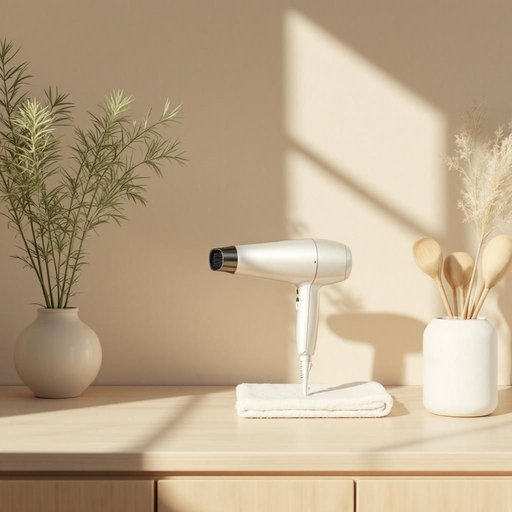

# hairdryer

<h1 style="font-size: 2.5em; font-weight: 300; letter-spacing: 2px; margin: 0; color: #2c3e50;">
/hairdryer*/
</h1>

---

---

## 例句

Before you rush out in the morning, could you please check if the hairdryer in the bathroom is working properly, since last time it overheated and shut off unexpectedly while I was trying to get ready for work?

*Before(/ˌbiˈfɔr/) you(/ju/) rush(/rəʃ/) out(/aʊt/) in(/ɪn/) the(/ðə/) morning,(/ˈmɔrnɪŋ,/) could(/kʊd/) you(/ju/) please(/pliz/) check(/ʧɛk/) if(/ɪf/) the(/ðə/) hairdryer(/hairdryer*/) in(/ɪn/) the(/ðə/) bathroom(/ˈbæθˌrum/) is(/ɪz/) working(/ˈwərkɪŋ/) properly,(/ˈprɑpərli,/) since(/sɪns/) last(/læst/) time(/taɪm/) it(/ɪt/) overheated(/ˈoʊvərˌhitɪd/) and(/ənd/) shut(/ʃət/) off(/ɔf/) unexpectedly(/ˌənɪkˈspɛktɪdli/) while(/waɪl/) I(/aɪ/) was(/wɑz/) trying(/traɪɪŋ/) to(/tɪ/) get(/gɪt/) ready(/ˈrɛdi/) for(/fər/) work?(/wərk?/)*

**翻译：** 早晨匆忙出门之前，麻烦您帮忙检查一下浴室的吹风机是否正常工作，上次我准备上班时，它因过热而突然自动关闭。

---

## 解释

英语单词“hairdryer”作为名词，在家居生活用品场景中指的是一种用于吹干头发的电器，常见于浴室、卧室或美发沙龙，使用时一般是在洗发后帮助头发快速干燥或者塑形造型。英语学习者在使用“hairdryer”时应注意其作为可数名词的属性，通常可与冠词连用，如a hairdryer或the hairdryer，且在复数形式中加s变为hairdryers；此外，常见的搭配有“use a hairdryer”（使用吹风机）、“turn on/off the hairdryer”（打开/关闭吹风机）等表达。词源方面，“hairdryer”由“hair”和“dryer”两个词合成，分别意指“头发”和“干燥器”，其中“dryer”源自动词“dry”加上名词后缀“-er”，表示执行干燥动作的器具，整体构成反映了其功能和用途。在中文语境中，“hairdryer”通常被准确翻译为“吹风机”或“电吹风”，这两个译名均指向同一物品，强调的是通过热风吹干头发的工具，且无特别褒贬含义或文化色彩，属于中性词汇，适用于正式或口语场合。

---

<small style="color: #999; font-size: 0.9em;">2025-07-27 09:14:04</small>

