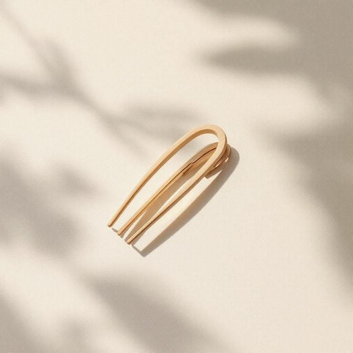

# hairpin

<h1 style="font-size: 2.5em; font-weight: 300; letter-spacing: 2px; margin: 0; color: #2c3e50;">
/hairpin*/
</h1>

---

---

## 例句

Although the hairpin, a small but intricately crafted accessory, was buried under several layers of fabric and dust, it held immense sentimental value as a family heirloom passed down through generations.

*Although(/ˌɔlˈðoʊ/) the(/ðə/) hairpin,(/hairpin*,/) a(/ə/) small(/smɔl/) but(/bət/) intricately(/ˈɪntrəkətli/) crafted(/ˈkræftɪd/) accessory,(/ækˈsɛsəri,/) was(/wɑz/) buried(/ˈbɛrid/) under(/ˈəndər/) several(/ˈsɛvərəl/) layers(/leɪərz/) of(/əv/) fabric(/ˈfæbrɪk/) and(/ənd/) dust,(/dəst,/) it(/ɪt/) held(/hɛld/) immense(/ˌɪˈmɛns/) sentimental(/ˌsɛnəˈmɛnəl/) value(/ˈvælju/) as(/ɛz/) a(/ə/) family(/ˈfæməli/) heirloom(/ˈɛˌrlum/) passed(/pæst/) down(/daʊn/) through(/θru/) generations.(/ˌʤɛnərˈeɪʃənz./)*

**翻译：** 尽管这枚发簪体积小巧、工艺精细，却埋藏在数层布料与尘埃之下，作为历代相传的家传之宝，承载着无比珍贵的情感价值。

---

## 解释

英语单词“hairpin”作为名词，在家居生活用品的语境中，主要指一种用来固定头发的发夹，通常是U形或针状的小夹子，常见于日常梳理头发时使用，具有实用和装饰功能。使用时，英语学习者应注意“hairpin”在句中多用作可数名词，如“a hairpin”表示一个发夹，复数形式为“hairpins”；此外，与动词搭配时常用“use a hairpin to…”“insert a hairpin into…”等表达。在词源上，“hairpin”一词由“hair”（头发）和“pin”（针）组成，直观描述了其形状和用途，起源于人类早期用小针状工具整理头发的传统，可追溯至古代。中文语境中，“hairpin”准确翻译为“发夹”，亦可以指“发簪”或“发针”，但在现代家居生活中“发夹”更为常用且通俗，反映其便捷小巧的实用属性。需要注意的是，“hairpin”在日常生活用品语境通常无贬义或褒义色彩，仅作为功能性物品描述，文化上并无特殊含义，但在不同文化中发饰的款式和使用场合可能有所差异。

---

<small style="color: #999; font-size: 0.9em;">2025-07-27 09:14:04</small>

