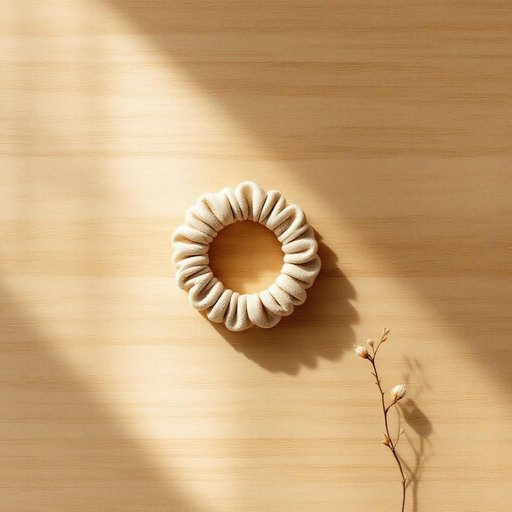

# hairtie

<h1 style="font-size: 2.5em; font-weight: 300; letter-spacing: 2px; margin: 0; color: #2c3e50;">
/hairtie*/
</h1>

---

---

## 例句

Although the hairtie was usually tangled with the set of colorful scarves and the loose keys, could you please pass me one from the drawer in the living room since I need to tie my hair back before chopping the vegetables for dinner?

*Although(/ˌɔlˈðoʊ/) the(/ðə/) hairtie(/hairtie*/) was(/wɑz/) usually(/ˈjuʒəwəli/) tangled(/ˈtæŋgəld/) with(/wɪθ/) the(/ðə/) set(/sɛt/) of(/əv/) colorful(/ˈkələrfəl/) scarves(/skɑrvz/) and(/ənd/) the(/ðə/) loose(/lus/) keys,(/kiz,/) could(/kʊd/) you(/ju/) please(/pliz/) pass(/pæs/) me(/mi/) one(/wən/) from(/frəm/) the(/ðə/) drawer(/drɔr/) in(/ɪn/) the(/ðə/) living(/ˈlɪvɪŋ/) room(/rum/) since(/sɪns/) I(/aɪ/) need(/nid/) to(/tɪ/) tie(/taɪ/) my(/maɪ/) hair(/hɛr/) back(/bæk/) before(/ˌbiˈfɔr/) chopping(/ˈʧɑpɪŋ/) the(/ðə/) vegetables(/ˈvɛʤtəbəlz/) for(/fər/) dinner?(/ˈdɪnər?/)*

**翻译：** 虽然发绳通常都和那堆五颜六色的围巾以及散乱的钥匙缠在一起，但你能否帮我从客厅的抽屉里拿一根？我需要在切晚饭的菜之前先把头发扎起来。

---

## 解释

hairtie作为名词，指的是用来绑扎头发的发圈或发绳，常见于家居生活用品范畴，主要用于将头发束起以保持整洁或造型，常见场合包括日常生活、运动、工作或休闲时需要束发的情境。英语学习者在使用hairtie时应注意，它通常作为可数名词出现，复数形式为hairties，且常与动词use、wear、buy、lose等搭配，如use a hairtie、wear hairties等；此外，hair tie写作时可以连写成hairtie或分开写成hair tie，两者均被接受，但连写更常见于非正式语境。词源上，hairtie由hair（头发）和tie（绑、系）组合而成，直观表达出绑头发的工具含义，反映了英语中复合词的典型构词方式，起源于实用日常用具的命名习惯。中文语境中，hairtie准确翻译为发圈或发绳，是指那种用来绑扎头发、通常由弹性材料制成的小物件，不带有褒义或贬义，属于中性词汇，文化上没有特别的色彩，但在形容头发绑扎用品时使用极为普遍且通俗，是描述类似家居用品或个人护理物品时的常用词。

---

<small style="color: #999; font-size: 0.9em;">2025-07-27 09:14:04</small>

