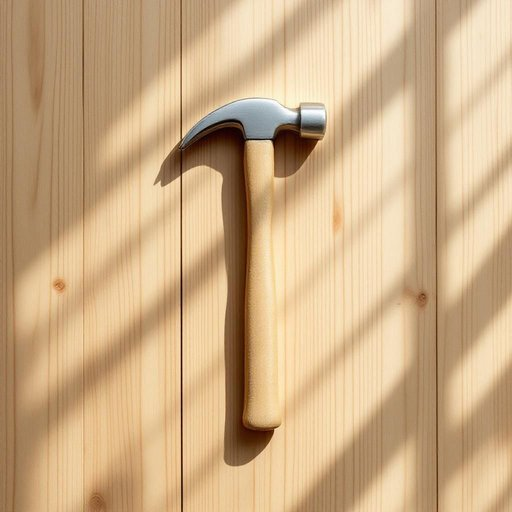

# hammer

<h1 style="font-size: 2.5em; font-weight: 300; letter-spacing: 2px; margin: 0; color: #2c3e50;">
/ˈhæmər/
</h1>

---

---

## 例句

I was trying to fix the loose shelf in the living room, but I realised I’d forgotten to bring the hammer, which is usually kept in the toolbox under the sink, so I had to run upstairs to get it before I could continue.

*I(/aɪ/) was(/wɑz/) trying(/traɪɪŋ/) to(/tɪ/) fix(/fɪks/) the(/ðə/) loose(/lus/) shelf(/ʃɛlf/) in(/ɪn/) the(/ðə/) living(/ˈlɪvɪŋ/) room,(/rum,/) but(/bət/) I(/aɪ/) realised(/ˈriəˌlaɪzd/) I’d(/i’d*/) forgotten(/fərˈgɑtən/) to(/tɪ/) bring(/brɪŋ/) the(/ðə/) hammer,(/ˈhæmər,/) which(/wɪʧ/) is(/ɪz/) usually(/ˈjuʒəwəli/) kept(/kɛpt/) in(/ɪn/) the(/ðə/) toolbox(/ˈtulˌbɔks/) under(/ˈəndər/) the(/ðə/) sink,(/sɪŋk,/) so(/soʊ/) I(/aɪ/) had(/hæd/) to(/tɪ/) run(/rən/) upstairs(/əpˈstɛrz/) to(/tɪ/) get(/gɪt/) it(/ɪt/) before(/ˌbiˈfɔr/) I(/aɪ/) could(/kʊd/) continue.(/kənˈtɪnju./)*

**翻译：** 我正打算修理客厅里松动的搁板，才发现忘带平时放在水槽下面工具箱里的锤子，于是不得不跑上楼去拿，才能继续动手。

---

## 解释

英语单词“hammer”作为家居生活用品领域的名词，指的是一种常见的手动工具，主要用于敲击钉子、固定物件或进行轻微敲打修理等场合，典型语境包括家庭DIY、装修、木工或修理工作中。学习者使用“hammer”时应注意其不可数与可数名词用法的区别，通常作为可数名词出现，如"a hammer"，表达“一把锤子”；此外常见搭配有“a claw hammer”（爪锤），“a sledgehammer”（大锤），“to use a hammer”（使用锤子）等，表达具体动作或工具类别。语法上，“hammer”作为名词可作主语、宾语或表语，无特殊变形，复数形式为“hammers”。词源上，“hammer”源自古英语“hamor”，与其他日耳曼语系语言中表示敲击工具的词汇同源，历史悠久，反映出锤子作为人类基本工具的普遍性和重要性。在中文语境中，“hammer”准确翻译为“锤子”，体现该工具的功能属性，属于中性词汇，无褒贬色彩，文化内涵主要关联劳动、修理及工艺制造，使用时注意区分具体类型（如铁锤、木锤等），以便表达准确。

---

<small style="color: #999; font-size: 0.9em;">2025-07-27 09:14:04</small>

