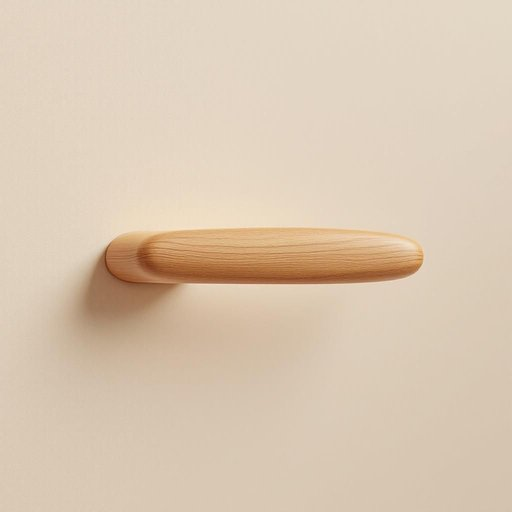

# handle

<h1 style="font-size: 2.5em; font-weight: 300; letter-spacing: 2px; margin: 0; color: #2c3e50;">
/ˈhændəl/
</h1>

---

---

## 例句

Could you please tighten the handle on the kitchen cabinet door, which has been wobbly for weeks and now risks falling off completely, especially since we often carry heavy pots and pans that put extra strain on it?

*Could(/kʊd/) you(/ju/) please(/pliz/) tighten(/ˈtaɪtən/) the(/ðə/) handle(/ˈhændəl/) on(/ɔn/) the(/ðə/) kitchen(/ˈkɪʧən/) cabinet(/ˈkæbənət/) door,(/dɔr,/) which(/wɪʧ/) has(/həz/) been(/bɪn/) wobbly(/ˈwɑbəli/) for(/fər/) weeks(/wiks/) and(/ənd/) now(/naʊ/) risks(/rɪsks/) falling(/ˈfɑlɪŋ/) off(/ɔf/) completely,(/kəmˈplitli,/) especially(/əˈspɛʃəli/) since(/sɪns/) we(/wi/) often(/ˈɔfən/) carry(/ˈkɛri/) heavy(/ˈhɛvi/) pots(/pɑts/) and(/ənd/) pans(/pænz/) that(/ðət/) put(/pʊt/) extra(/ˈɛkstrə/) strain(/streɪn/) on(/ɔn/) it?(/ɪt?/)*

**翻译：** 请您帮忙拧紧厨房橱柜门上的把手，该把手已晃动数周，现有完全脱落的风险，尤其是我们经常搬动沉重的锅具，给它带来了额外的压力。

---

## 解释

英语单词“handle”作为名词，在家居生活用品的语境中通常指“把手”或“手柄”，是家具、门窗、抽屉或器皿等物品上供人手握以便开关或搬动的部分。具体使用场合多见于描述门把手（door handle）、抽屉把手（drawer handle）、锅柄（pot handle）等，强调其物理形状和功能。在语法层面，作为可数名词，“handle”在使用时需注意单复数形式（one handle, two handles），且通常与具体物品名词连用，如“the handle of the door”，常见搭配还有“grab the handle”、“loose handle”等，英语学习者应注意该词在句中充当名词时不可用作动词形式，避免语法混淆。词源上，“handle”来自古英语“handlian”，意为“用手操作”，进而演变为表示“拿、握的部分”，体现了其以手为媒介的功能属性。在中文语境中，“handle”准确翻译为“把手”或“手柄”，强调实物的部件属性，没有特殊褒贬含义或文化色彩，属于中性词汇，使用时重点理解其物理功能和装置部件属性，以便准确表达和理解家居用品中的具体部件。

---

<small style="color: #999; font-size: 0.9em;">2025-07-27 09:14:04</small>

