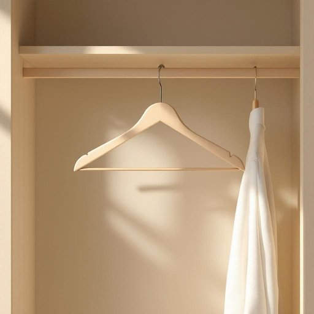

# hanger

<h1 style="font-size: 2.5em; font-weight: 300; letter-spacing: 2px; margin: 0; color: #2c3e50;">
/ˈhæŋər/
</h1>

---

---

## 例句

Could you please pass me the wooden hanger from the wardrobe, the one with the velvet coating that prevents my delicate shirts from slipping off, because all the plastic hangers seem to be broken or missing their hooks?

*Could(/kʊd/) you(/ju/) please(/pliz/) pass(/pæs/) me(/mi/) the(/ðə/) wooden(/ˈwʊdən/) hanger(/ˈhæŋər/) from(/frəm/) the(/ðə/) wardrobe,(/ˈwɔrˌdroʊb,/) the(/ðə/) one(/wən/) with(/wɪθ/) the(/ðə/) velvet(/ˈvɛlvət/) coating(/ˈkoʊtɪŋ/) that(/ðət/) prevents(/prɪˈvɛnts/) my(/maɪ/) delicate(/ˈdɛləkət/) shirts(/ʃərts/) from(/frəm/) slipping(/sˈlɪpɪŋ/) off,(/ɔf,/) because(/bɪˈkəz/) all(/ɔl/) the(/ðə/) plastic(/ˈplæstɪk/) hangers(/ˈhæŋərz/) seem(/sim/) to(/tɪ/) be(/bi/) broken(/ˈbroʊkən/) or(/ər/) missing(/ˈmɪsɪŋ/) their(/ðɛr/) hooks?(/hʊks?/)*

**翻译：** 你能帮我从衣柜里拿一下那个带有天鹅绒涂层的木质衣架吗？它能防止我那些娇嫩的衬衫滑落，因为所有的塑料衣架似乎都坏了或者挂钩都不见了。

---

## 解释

英语单词“hanger”在家居生活用品语境中作为名词，通常指用来悬挂衣物的挂衣架或衣架，其具体使用场合多见于整理、收纳衣服的场景，例如“put your coat on the hanger”（把你的外套挂在衣架上）。在语法上，“hanger”属于可数名词，使用时需注意单复数形式，如“一只衣架”为“a hanger”，“多只衣架”为“hangers”。常见搭配包括“clothes hanger”（衣服挂架），“coat hanger”（大衣衣架），“wire hanger”（铁丝衣架）等，表达时也常用短语如“hang on a hanger”（挂在衣架上）。词源方面，“hanger”源自动词“hang”（悬挂），加上名词后缀“-er”，意指“用于悬挂的物品”，起源可追溯到中古英语时期。中文语境中，“hanger”常被准确翻译为“衣架”或“挂衣架”，指代各种形态的悬挂衣物的器具，理解上无特殊含义或褒贬色彩，属于中性日常用语。此外，需要注意的是“hanger”在不同语境下还有其他含义，如军人用语中指悬挂军功勋章的带子，或建筑结构中指悬挂物的吊杆，但在家居生活用品场景下仅指衣架，无特殊文化内涵或隐喻意义，使用时只需根据语境明确指代即可。

---

<small style="color: #999; font-size: 0.9em;">2025-07-27 09:14:04</small>

