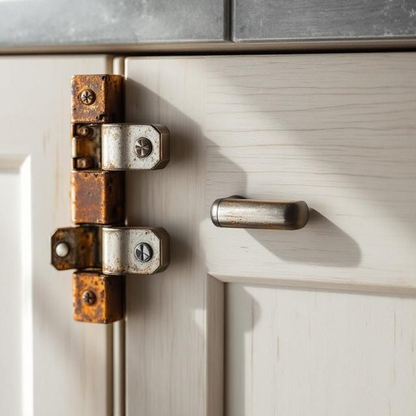

# hardware

<h1 style="font-size: 2.5em; font-weight: 300; letter-spacing: 2px; margin: 0; color: #2c3e50;">
/ˈhɑrdˌwɛr/
</h1>

---

---

## 例句

When I was fixing the kitchen cupboard yesterday, I realised that the old hardware, including the hinges and handles, was so worn out that not only did it squeak loudly whenever the door was opened, but it also made the entire structure feel unstable, which is why I decided to replace everything with more durable, modern fittings I found at the local hardware store.

*When(/wɪn/) I(/aɪ/) was(/wɑz/) fixing(/ˈfɪksɪŋ/) the(/ðə/) kitchen(/ˈkɪʧən/) cupboard(/ˈkəbərd/) yesterday,(/ˈjɛstərˌdeɪ,/) I(/aɪ/) realised(/ˈriəˌlaɪzd/) that(/ðət/) the(/ðə/) old(/oʊld/) hardware,(/ˈhɑrdˌwɛr,/) including(/ˌɪnˈkludɪŋ/) the(/ðə/) hinges(/ˈhɪnʤɪz/) and(/ənd/) handles,(/ˈhændəlz,/) was(/wɑz/) so(/soʊ/) worn(/wɔrn/) out(/aʊt/) that(/ðət/) not(/nɑt/) only(/ˈoʊnli/) did(/dɪd/) it(/ɪt/) squeak(/skwik/) loudly(/ˈlaʊdli/) whenever(/wɛˈnɛvər/) the(/ðə/) door(/dɔr/) was(/wɑz/) opened,(/ˈoʊpənd,/) but(/bət/) it(/ɪt/) also(/ˈɔlsoʊ/) made(/meɪd/) the(/ðə/) entire(/ɪnˈtaɪər/) structure(/ˈstrəkʧər/) feel(/fil/) unstable,(/ənˈsteɪbəl,/) which(/wɪʧ/) is(/ɪz/) why(/waɪ/) I(/aɪ/) decided(/ˌdɪˈsaɪdɪd/) to(/tɪ/) replace(/ˌriˈpleɪs/) everything(/ˈɛvriˌθɪŋ/) with(/wɪθ/) more(/mɔr/) durable,(/ˈdʊrəbəl,/) modern(/ˈmɑdərn/) fittings(/ˈfɪtɪŋz/) I(/aɪ/) found(/faʊnd/) at(/æt/) the(/ðə/) local(/ˈloʊkəl/) hardware(/ˈhɑrdˌwɛr/) store.(/stɔr./)*

**翻译：** 昨天修理厨房橱柜时，我发现旧的五金件，包括合页和把手，已经磨损严重，不仅每次开门时都会发出刺耳的吱吱声，还让整个结构显得不够牢固。正因如此，我决定用在当地五金店买到的更耐用、更现代的配件全部更换。

---

## 解释

英语单词hardware作为名词在家居生活用品的语境中，主要指房屋、家具或门窗等装置所用的五金器件，如门把手、铰链、锁具、螺丝钉等，通常用于描述那些由金属或坚固材料制成、用于安装或维修的物品。在具体使用场合上，常见于家庭装修、家具组装、维修工具或建材商店的对话中，例如kitchen hardware（厨房五金）或door hardware（门窗五金），表示与这些物品相关的配件或组件。对于英语学习者而言，hardware通常作为不可数名词使用，但在某些情况下也可以用作复数形式hardwares，不过后者较少见且不常用于正式表达，此外hardware store是常用固定搭配，指五金店，而在搭配时亦常见hardware tools（五金工具）或hardware fittings（五金配件）。语法上需注意它作为集合名词既可以指总体的五金器件，又可具体指某一套或一类五金产品。词源方面，hardware一词源自中古英语hard意为坚硬，加上ware意指制品，合起来意为坚硬的物品，最早用于指各种金属制品及耐用的工具和器具，逐渐衍生成现今建筑和家具用五金的专指。中文语境中，hardware在家居用品领域一般翻译为五金或五金配件，强调其材质坚固、用于安装和连接作用的功能，与电子或计算机领域中的硬件不同，因此理解时需结合上下文区分以免混淆。该词在使用中无明显褒贬色彩，属于中性实用词汇，主要表达物品类别和功能，文化内涵较少，更多体现生活中的实用价值和工业制造特性。

---

<small style="color: #999; font-size: 0.9em;">2025-07-27 09:14:04</small>

