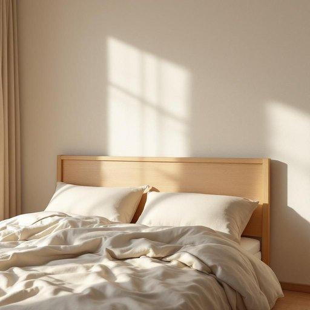

# headboard

<h1 style="font-size: 2.5em; font-weight: 300; letter-spacing: 2px; margin: 0; color: #2c3e50;">
/ˈhɛdˌbɔrd/
</h1>

---

---

## 例句

After debating for hours about whether to repaint the whole bedroom or just update the furniture, her ultimate decision focused on the headboard, a central piece of furniture that not only complements the floral wallpaper but also offers additional comfort during bedtime reading.

*After(/ˈæftər/) debating(/dəˈbeɪtɪŋ/) for(/fər/) hours(/aʊərz/) about(/əˈbaʊt/) whether(/ˈwɛðər/) to(/tɪ/) repaint(/riˈpeɪnt/) the(/ðə/) whole(/hoʊl/) bedroom(/ˈbɛˌdrum/) or(/ər/) just(/ʤɪst/) update(/ˈəpˌdeɪt/) the(/ðə/) furniture,(/ˈfərnɪʧər,/) her(/hər/) ultimate(/ˈəltəmət/) decision(/dɪˈsɪʒən/) focused(/ˈfoʊkɪst/) on(/ɔn/) the(/ðə/) headboard,(/ˈhɛdˌbɔrd,/) a(/ə/) central(/ˈsɛntrəl/) piece(/pis/) of(/əv/) furniture(/ˈfərnɪʧər/) that(/ðət/) not(/nɑt/) only(/ˈoʊnli/) complements(/ˈkɑmpləmənts/) the(/ðə/) floral(/ˈflɔrəl/) wallpaper(/ˈwɔlˌpeɪpər/) but(/bət/) also(/ˈɔlsoʊ/) offers(/ˈɔfərz/) additional(/əˈdɪʃənəl/) comfort(/ˈkəmfərt/) during(/ˈdʊrɪŋ/) bedtime(/ˈbɛdˌtaɪm/) reading.(/ˈrɛdɪŋ./)*

**翻译：** 经过数小时的讨论，是重新粉刷整个卧室还是仅仅更新家具，她最终决定重点改造床头板。这件家具不仅与花卉墙纸相得益彰，还在睡前阅读时提供了额外的舒适感。

---

## 解释

headboard作为名词，主要指床头板，是安装在床架头部的一个家具部件，用于支撑床垫、保护墙面并增加卧室装饰的美观。在家居生活用品的语境中，headboard通常出现在描述卧室布置、家具选购或室内设计等场合，比如a wooden headboard（木质床头板）或an upholstered headboard（软包床头板）。英语学习者使用headboard时，应注意其作为可数名词，通常与冠词连用（a headboard, the headboard），且常与形容词搭配，描述材质（wooden, metal）、风格（modern, vintage）或功能（adjustable）。此外，headboard可以与bed（bed with a headboard）连用形成固定表达。词源方面，headboard由head（头部）和board（板）组合而成，最初指的是固定在床头的一块木板，起源于传统家具制作中为保护床头和提供支撑的实用设计。在中文语境中，headboard准确翻译为床头板或床头靠板，其含义明确且无褒贬色彩，主要强调功能性和装饰性，文化上没有特别的象征意义，属于日常家具用品的标准用词。

---

<small style="color: #999; font-size: 0.9em;">2025-07-27 09:14:04</small>

