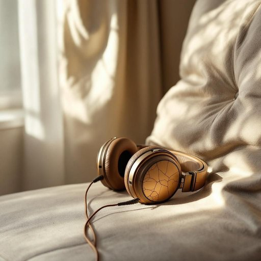

# headphone

<h1 style="font-size: 2.5em; font-weight: 300; letter-spacing: 2px; margin: 0; color: #2c3e50;">
/ˈhɛdˌfoʊn/
</h1>

---

---

## 例句

Could you please pass me the headphone that is lying next to the sofa, the one with the cracked ear cushion which I use for watching movies late at night so that I do not disturb the rest of the family?

*Could(/kʊd/) you(/ju/) please(/pliz/) pass(/pæs/) me(/mi/) the(/ðə/) headphone(/ˈhɛdˌfoʊn/) that(/ðət/) is(/ɪz/) lying(/laɪɪŋ/) next(/nɛkst/) to(/tɪ/) the(/ðə/) sofa,(/ˈsoʊfə,/) the(/ðə/) one(/wən/) with(/wɪθ/) the(/ðə/) cracked(/krækt/) ear(/ɪr/) cushion(/ˈkʊʃən/) which(/wɪʧ/) I(/aɪ/) use(/juz/) for(/fər/) watching(/ˈwɑʧɪŋ/) movies(/ˈmuviz/) late(/leɪt/) at(/æt/) night(/naɪt/) so(/soʊ/) that(/ðət/) I(/aɪ/) do(/du/) not(/nɑt/) disturb(/dɪˈstərb/) the(/ðə/) rest(/rɛst/) of(/əv/) the(/ðə/) family?(/ˈfæməli?/)*

**翻译：** 请把沙发旁边那副耳机递给我，就是那副耳罩有裂痕的，我晚上看电影时用它，这样不会打扰到家里的其他人。

---

## 解释

headphone作为名词在家居生活用品的语境中指的是一种戴在头部覆盖或插入耳朵以便个人聆听音频的电子设备通常用于听音乐看电影或进行语音通话常见于家庭娱乐或工作环境中英语学习者在使用该词时应注意其为复数形态的单数名词通常用作复数headphones且多与动词wear（戴）、put on（戴上）、use（使用）等搭配常见表达包括listen with headphones（用耳机听）和wireless/wired headphones（无线/有线耳机）此外headphone本身严格指单个耳机但日常口语中多用复数形式headphones指整副耳机词源上headphone由head（头部）与phone（声音源自希腊语phōnē意为声音）组成强调设备与头部的关系以及其传递声音的功能在中文语境中headphone准确译为耳机通常指覆盖或插入耳朵的听音设备无特别褒贬含义属于中性词汇体现的是一种便捷私密的音频聆听工具因而在文化上多与个人空间和娱乐体验相关联但需注意耳机一词范围较广具体语境可能指代入耳式头戴式等多种形式的设备

---

<small style="color: #999; font-size: 0.9em;">2025-07-27 09:14:04</small>

