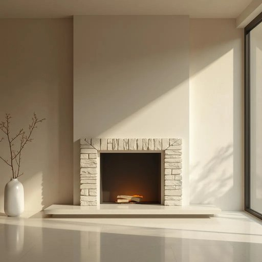

# hearth

<h1 style="font-size: 2.5em; font-weight: 300; letter-spacing: 2px; margin: 0; color: #2c3e50;">
/hɑrθ/
</h1>

---

---

## 例句

On chilly evenings, the hearth’s warmth, which emanates from the crackling fire, not only envelops the entire living room but also fosters a cozy atmosphere that encourages long conversations and shared stories.

*On(/ɔn/) chilly(/ˈʧɪli/) evenings,(/ˈivnɪŋz,/) the(/ðə/) hearth’s(/hearth’s*/) warmth,(/wɔrmθ,/) which(/wɪʧ/) emanates(/ˈɛməneɪts/) from(/frəm/) the(/ðə/) crackling(/ˈkræklɪŋ/) fire,(/faɪər,/) not(/nɑt/) only(/ˈoʊnli/) envelops(/ɪnˈvɛləps/) the(/ðə/) entire(/ɪnˈtaɪər/) living(/ˈlɪvɪŋ/) room(/rum/) but(/bət/) also(/ˈɔlsoʊ/) fosters(/ˈfɑstərz/) a(/ə/) cozy(/ˈkoʊzi/) atmosphere(/ˈætməsˌfɪr/) that(/ðət/) encourages(/ɪnˈkərəʤəz/) long(/lɔŋ/) conversations(/ˌkɑnvərˈseɪʃənz/) and(/ənd/) shared(/ʃɛrd/) stories.(/ˈstɔriz./)*

**翻译：** 在寒冷的夜晚，炉火噼啪作响，散发出的温暖不仅充盈了整个客厅，更营造出一种温馨的氛围，促使人们长时间交谈、分享故事。

---

## 解释

英语单词“hearth”作为名词在家居生活用品语境中主要指壁炉前的地面或炉边的砖石部分，通常是一个室内用来生火取暖的地方，因此常出现在描述传统家庭取暖设施、壁炉设计及居家温馨氛围的场合。它不仅是实际的物理空间，也是象征家庭温暖、团聚与安宁的重要意象。在使用此词时，英语学习者需注意它通常用作单数，且多用于书面语或较正式的语境，常见搭配有“hearth and home”（象征家庭生活与温暖），“hearth fire”（壁炉火），以及“by the hearth”（在炉边）等表达，语法上一般作为具体名词出现，可与冠词连用如“the hearth”，但不常用于复数形式。词源方面，“hearth”源自古英语“heorð”，意指家中炉灶所在的地面，随着时间发展逐渐引申为家庭温暖的象征，体现了古时家庭聚会围炉的生活习惯。中文中，“hearth”准确翻译为“炉边”或“壁炉前的地面”，在语境上也可引申为“家庭的温暖中心”或“家的象征”，具有明显的正面文化内涵，通常体现出温馨、安全及传统家庭的意境，不含贬义或负面色彩，使用时应避免与现代无壁炉的居家环境混淆，理解为既指物理空间又象征家居温馨的双重含义最为恰当。

---

<small style="color: #999; font-size: 0.9em;">2025-07-27 09:14:04</small>

