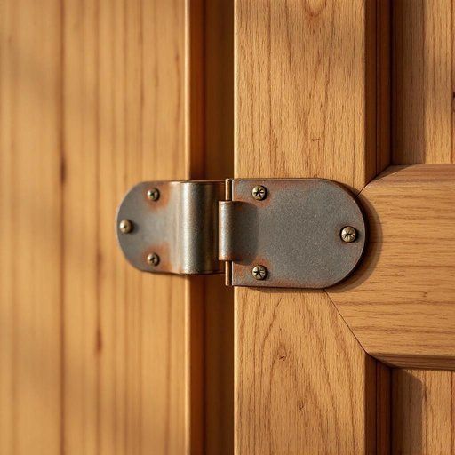

# hinge

<h1 style="font-size: 2.5em; font-weight: 300; letter-spacing: 2px; margin: 0; color: #2c3e50;">
/hɪnʤ/
</h1>

---

---

## 例句

The kitchen cabinet door, which has been creaking annoyingly every time it’s opened or closed, finally gave way because the hinge, rusted through years of neglect and exposure to steam, could no longer support the weight of the heavy wooden panel.

*The(/ðə/) kitchen(/ˈkɪʧən/) cabinet(/ˈkæbənət/) door,(/dɔr,/) which(/wɪʧ/) has(/həz/) been(/bɪn/) creaking(/ˈkrikɪŋ/) annoyingly(/annoyingly*/) every(/ˈɛvəri/) time(/taɪm/) it’s(/it’s*/) opened(/ˈoʊpənd/) or(/ər/) closed,(/kloʊzd,/) finally(/ˈfaɪnəli/) gave(/geɪv/) way(/weɪ/) because(/bɪˈkəz/) the(/ðə/) hinge,(/hɪnʤ,/) rusted(/ˈrəstɪd/) through(/θru/) years(/jɪrz/) of(/əv/) neglect(/nɪˈglɛkt/) and(/ənd/) exposure(/ɪkˈspoʊʒər/) to(/tɪ/) steam,(/stim,/) could(/kʊd/) no(/noʊ/) longer(/ˈlɔŋgər/) support(/səˈpɔrt/) the(/ðə/) weight(/weɪt/) of(/əv/) the(/ðə/) heavy(/ˈhɛvi/) wooden(/ˈwʊdən/) panel.(/ˈpænəl./)*

**翻译：** 厨房橱柜门每次开关时总是发出令人烦躁的吱吱声，终于因铰链多年来被忽视并受蒸汽侵蚀而生锈，无法再承受沉重木板的重量而脱落。

---

## 解释

“hinge”作为名词在家居生活用品的语境中，指的是连接门、窗、盖子等可开合物体与固定框架之间的转动装置，即“铰链”或“合页”，它允许门窗等物体绕轴旋转以实现开关功能。具体使用场合包括描述门窗的结构部件、家具柜门的连接部分等，如“door hinge”（门铰链）、“cabinet hinge”（橱柜铰链）。英语学习者应注意“hinge”通常是可数名词，表达时常用复数形式“hinges”，且常与表示位置或功能的词连用，如“a loose hinge”（松动的铰链）、“paint the hinges”（漆铰链）。“hinge”还常出现在短语“on the hinges of something”或“hinge on something”中，引申为“取决于”或“系于”，但这属于动词用法，需区别名词用法。词源方面，“hinge”源自古英语“hyns”或“hynsian”，意指门轴或轴销，最早用于描述支撑转动的机械部件，体现其功能核心。中文语境中，“铰链”是最准确的翻译，既表述了其机械结构也体现其转轴功能，无特殊褒贬色彩，是中性且技术性强的词汇，广泛应用于日常家居和工业制造领域，使用时无需担心文化差异或隐含意义。

---

<small style="color: #999; font-size: 0.9em;">2025-07-27 09:14:04</small>

