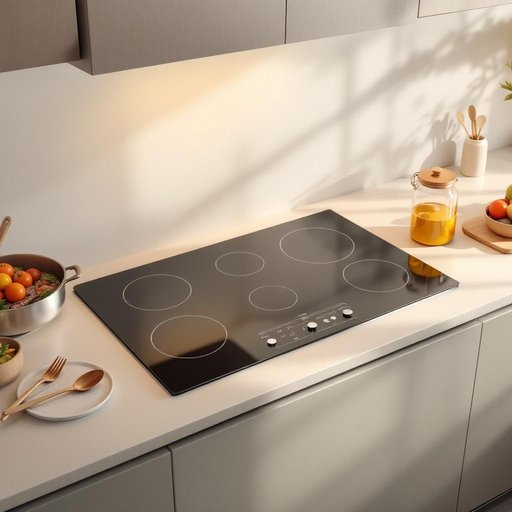

# hob

<h1 style="font-size: 2.5em; font-weight: 300; letter-spacing: 2px; margin: 0; color: #2c3e50;">
/hɑb/
</h1>

---

---

## 例句

After carefully examining the manufacturer's instructions, she realised that the new hob, which featured both induction zones and a built-in timer, would not only save energy but also allow her to prepare multiple dishes simultaneously without overheating the kitchen.

*After(/ˈæftər/) carefully(/ˈkɛrfəli/) examining(/ɪgˈzæmɪnɪŋ/) the(/ðə/) manufacturer's(/ˌmænjəˈfækʧərərz/) instructions,(/ˌɪnˈstrəkʃənz,/) she(/ʃi/) realised(/ˈriəˌlaɪzd/) that(/ðət/) the(/ðə/) new(/nu/) hob,(/hɑb,/) which(/wɪʧ/) featured(/ˈfiʧərd/) both(/boʊθ/) induction(/ˌɪnˈdəkʃən/) zones(/zoʊnz/) and(/ənd/) a(/ə/) built-in(/ˈbɪlˌtɪn/) timer,(/ˈtaɪmər,/) would(/wʊd/) not(/nɑt/) only(/ˈoʊnli/) save(/seɪv/) energy(/ˈɛnərʤi/) but(/bət/) also(/ˈɔlsoʊ/) allow(/əˈlaʊ/) her(/hər/) to(/tɪ/) prepare(/priˈpɛr/) multiple(/ˈməltəpəl/) dishes(/ˈdɪʃɪz/) simultaneously(/ˌsaɪməlˈteɪniəsli/) without(/wɪˈθaʊt/) overheating(/ˈoʊvərˌhitɪŋ/) the(/ðə/) kitchen.(/ˈkɪʧən./)*

**翻译：** 仔细阅读厂家说明后，她意识到这款配备了感应区和内置定时器的新灶具不仅能节能，还能让她同时烹饪多道菜肴，而不会使厨房过热。

---

## 解释

英语单词“hob”在家居生活用品的语境中，作为名词主要指厨房炉灶上的加热板或烹饪区域，尤其常见于英式英语中，用来表示电炉、煤气炉或陶瓷炉的顶部平面，用以放置锅具烧煮食物。具体使用场合通常是在描述家用厨房设施时，如“How do you clean the hob?”（你如何清洁炉灶面？）或“Turn off the hob after cooking”（做完饭后关掉炉灶）。英语学习者在使用“hob”时需要注意，它通常作为可数名词出现，常与动词“turn on/off”、“clean”、“cook on”等搭配，且多用在英式英语环境中，美式英语中常用“stove top”代替。此外，“hob”也可指火炉边缘的凸起部分，但在现代家居语境中主要指加热区。词源上，“hob”起源于中古英语，原指壁炉或火炉上用于加热食物或锅具的铁架，后来延伸指代烹饪表面，这反映了其与火炉取暖和烹饪历史的紧密联系。在中文中，“hob”准确翻译为“炉灶面”或“炉头”，强调的是烹饪加热部分，而非整台炉具，避免与“炉子”泛指整体设备混淆。该词本身无褒贬色彩，属于中性技术或家庭用语，但在不同英语变体中使用频率和习惯有差异，学习时应结合具体语境和地区差异合理应用。

---

<small style="color: #999; font-size: 0.9em;">2025-07-27 09:14:04</small>

