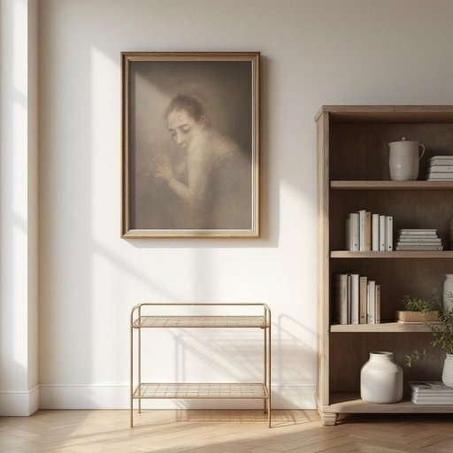

# holder

<h1 style="font-size: 2.5em; font-weight: 300; letter-spacing: 2px; margin: 0; color: #2c3e50;">
/ˈhoʊldər/
</h1>

---

---

## 例句

The holder, which you see resting beside the ancient bookcase and under the fading portrait, serves not only as a decorative piece but also as a symbol of heritage that connects past generations with the present.

*The(/ðə/) holder,(/ˈhoʊldər,/) which(/wɪʧ/) you(/ju/) see(/si/) resting(/ˈrɛstɪŋ/) beside(/ˌbiˈsaɪd/) the(/ðə/) ancient(/ˈeɪnʧənt/) bookcase(/ˈbʊkˌkeɪs/) and(/ənd/) under(/ˈəndər/) the(/ðə/) fading(/ˈfeɪdɪŋ/) portrait,(/ˈpɔrtrət,/) serves(/sərvz/) not(/nɑt/) only(/ˈoʊnli/) as(/ɛz/) a(/ə/) decorative(/ˈdɛkrətɪv/) piece(/pis/) but(/bət/) also(/ˈɔlsoʊ/) as(/ɛz/) a(/ə/) symbol(/ˈsɪmbəl/) of(/əv/) heritage(/ˈhɛrɪtɪʤ/) that(/ðət/) connects(/kəˈnɛkts/) past(/pæst/) generations(/ˌʤɛnərˈeɪʃənz/) with(/wɪθ/) the(/ðə/) present.(/ˈprɛzənt./)*

**翻译：** 您看到的这个摆放在古老书柜旁、渐渐褪色的画像下的托架，不仅是一件装饰品，更象征着将过去的世代与当下紧密相连的传统遗产。

---

## 解释

holder作为名词在家居生活用品的语境中，通常指用于承载、固定或存放某物的器具或装置，如笔筒(pen holder)、杯架(cup holder)、牙刷架(toothbrush holder)等，主要功能是帮助整理和安放物品，使空间更整洁，使用场合多见于厨房、浴室、书房或办公环境。英语学习者在使用holder时应注意它通常与所承载的物品名称构成复合名词，如card holder（卡夹）、towel holder（毛巾架），结构上多数为名词+holder，表示某物的支架或容器，此外，holder作为可数名词，单复数形式是holder/holders，用法平常，没有特殊的语法复杂性，但注意复合词中holder后置规律。词源方面，holder源自古英语healdan，意为持有、控制，加上名词后缀-er构成表示执行动作的人或物，因此本义即为持有者或承载物，这种含义自然延伸至具体物品承载工具。中文语境下，holder常译作架、托、座、夹等，具体翻译需结合所搭配的物品名称，含义准确体现用来固定或存放某物的器具，无褒贬色彩，属于中性词汇。整体来看，holder在家居用品语境中是一个实用且常见的词，能够方便表达各种物品的支架或容器，帮助英语学习者准确描述日常生活中的整理工具和用品。

---

<small style="color: #999; font-size: 0.9em;">2025-07-27 09:14:04</small>

