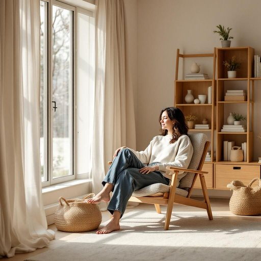

# home

<h1 style="font-size: 2.5em; font-weight: 300; letter-spacing: 2px; margin: 0; color: #2c3e50;">
/hoʊm/
</h1>

---

---

## 例句

After a long day of assembling the new bookshelf and rearranging the living room, she finally sank into the cozy armchair by the window, feeling that there truly was no place like home where warmth, comfort, and familiarity seamlessly blend together.

*After(/ˈæftər/) a(/ə/) long(/lɔŋ/) day(/deɪ/) of(/əv/) assembling(/əˈsɛmbəlɪŋ/) the(/ðə/) new(/nu/) bookshelf(/ˈbʊkˌʃɛlf/) and(/ənd/) rearranging(/ˌriərˈeɪnʤɪŋ/) the(/ðə/) living(/ˈlɪvɪŋ/) room,(/rum,/) she(/ʃi/) finally(/ˈfaɪnəli/) sank(/sæŋk/) into(/ˈɪntu/) the(/ðə/) cozy(/ˈkoʊzi/) armchair(/ˈɑrmˌʧɛr/) by(/baɪ/) the(/ðə/) window,(/ˈwɪndoʊ,/) feeling(/ˈfilɪŋ/) that(/ðət/) there(/ðɛr/) truly(/ˈtruli/) was(/wɑz/) no(/noʊ/) place(/pleɪs/) like(/laɪk/) home(/hoʊm/) where(/wɛr/) warmth,(/wɔrmθ,/) comfort,(/ˈkəmfərt,/) and(/ənd/) familiarity(/fəˌmɪˈljɛrəti/) seamlessly(/ˈsimləsli/) blend(/blɛnd/) together.(/təˈgɛðər./)*

**翻译：** 忙碌了一整天，组装新书架、重新布置客厅后，她终于沉入靠窗的那把舒适扶手椅中，感受到那种真正无可替代的归属感——温暖、舒适与熟悉在此完美交融。

---

## 解释

英语单词“home”作为名词在家居生活用品的语境中，通常指“住所”或“家”，具体使用场合包括指人们居住和生活的地方，如房屋、公寓等，强调的是一个提供生活起居、安全感和归属感的环境。学习者在使用“home”时需注意，其作为不可数名词时侧重于“家”的抽象概念，如情感归属；作为可数名词时则指具体的房屋，如“a home”；常见搭配有“at home”（在家）、“go home”（回家）和“home appliances”（家用电器）等。另外，“home”在句中多用作主语或宾语，且不用于复数形式（表示家的概念时），但具体住宅时可用复数。词源上，“home”源自古英语“hām”，意指村庄、房屋及其周边地区，反映了“居住地”的含义，体现了人类对固定居所的长期认知和文化重视。中文中，“home”准确翻译为“家”或“住所”，涵盖了生活居所及其背后的情感归属、温馨氛围等内涵。在中文语境里，“家”不仅是物理空间，更承载亲情和安全感，与英语“home”在情感色彩上高度契合，但使用时应避免将“home”直译为“房子”，因“房子”偏重物理建筑而“home”更强调生活和情感层面；此外，“home”在文化上带有积极、温暖的褒义色彩，象征稳定和幸福，因此学习时要注意其文化内涵与用法差异，避免机械等同。

---

<small style="color: #999; font-size: 0.9em;">2025-07-27 09:14:04</small>

