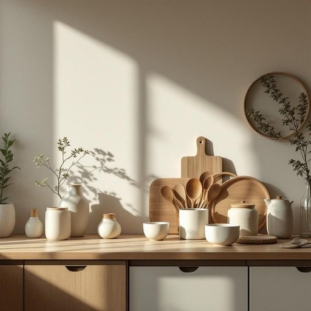

# homeware

<h1 style="font-size: 2.5em; font-weight: 300; letter-spacing: 2px; margin: 0; color: #2c3e50;">
/homeware*/
</h1>

---

---

## 例句

When we moved into the new flat, I spent hours browsing through various shops to find unique homeware that not only matched the vintage aesthetic we were aiming for but also combined functionality with style, such as handcrafted ceramics and sustainable wooden utensils, which ultimately transformed the kitchen into a warm, inviting space perfect for entertaining guests.

*When(/wɪn/) we(/wi/) moved(/muvd/) into(/ˈɪntu/) the(/ðə/) new(/nu/) flat,(/flæt,/) I(/aɪ/) spent(/spɛnt/) hours(/aʊərz/) browsing(/ˈbraʊzɪŋ/) through(/θru/) various(/ˈvɛriəs/) shops(/ʃɑps/) to(/tɪ/) find(/faɪnd/) unique(/juˈnik/) homeware(/homeware*/) that(/ðət/) not(/nɑt/) only(/ˈoʊnli/) matched(/mæʧt/) the(/ðə/) vintage(/ˈvɪntɪʤ/) aesthetic(/ɛsˈθɛtɪk/) we(/wi/) were(/wər/) aiming(/ˈeɪmɪŋ/) for(/fər/) but(/bət/) also(/ˈɔlsoʊ/) combined(/kəmˈbaɪnd/) functionality(/ˌfəŋkʃəˈnælɪti/) with(/wɪθ/) style,(/staɪl,/) such(/səʧ/) as(/ɛz/) handcrafted(/ˈhændˌkræftɪd/) ceramics(/sərˈæmɪks/) and(/ənd/) sustainable(/səˈsteɪnəbəl/) wooden(/ˈwʊdən/) utensils,(/juˈtɛnsəlz,/) which(/wɪʧ/) ultimately(/ˈəltəmətli/) transformed(/trænsˈfɔrmd/) the(/ðə/) kitchen(/ˈkɪʧən/) into(/ˈɪntu/) a(/ə/) warm,(/wɔrm,/) inviting(/ˌɪnˈvaɪtɪŋ/) space(/speɪs/) perfect(/ˈpərˌfɪkt/) for(/fər/) entertaining(/ˌɛnərˈteɪnɪŋ/) guests.(/gɛsts./)*

**翻译：** 搬进新公寓时，我花了好几个小时逛遍各式各样的商店，寻找既符合我们追求的复古美学，又兼具实用与美感的独特家居用品，比如手工陶瓷和可持续木制餐具，最终让厨房变成了一个温馨宜人、非常适合招待客人的空间。

---

## 解释

英语单词homeware作为名词主要指家居生活用品，涵盖家中使用的各类日常物品，如厨房用具、餐具、床上用品、浴室用品以及家居装饰品等，常见于零售、购物或室内设计等语境中。学习者在使用该词时应注意其不可数或复数形式通常为复数homewares，但在英国英语中多用复数形式表示这一类别的物品，且常见搭配有buy homeware(s)、homeware shop/store、homeware section等，表达时常用于描述某类商品总称而非单个具体物品。该词由home（家）和ware（物品、商品）组合而成，其中ware源自古英语waru，意指货物或特定用途的物品，因而homeware侧重指与家庭使用相关的商品。中文语境中，homeware一般译为家居用品或家居生活用品，强调产品功能性及与家庭环境的紧密联系，无明显褒贬色彩，但在不同文化背景下对家居用品的具体分类和重视程度可能存在差异，且该词在某些场合可能偏重于商店或市场领域的商品类别而非个人生活细节。综上，homeware是一种较为中性且适用于多种与家庭生活密切相关物品描述的英语名词，合理理解其含义有助于提高对家居类话题的表达准确性。

---

<small style="color: #999; font-size: 0.9em;">2025-07-27 09:14:04</small>

