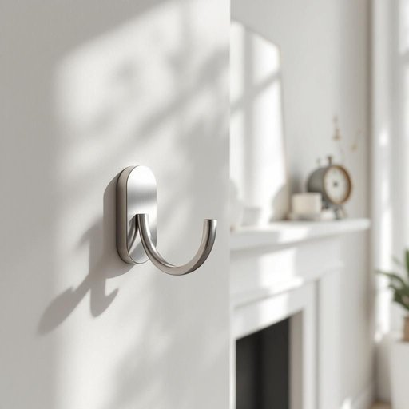

# hook

<h1 style="font-size: 2.5em; font-weight: 300; letter-spacing: 2px; margin: 0; color: #2c3e50;">
/hʊk/
</h1>

---

---

## 例句

I noticed the clock on the mantelpiece stopped ticking during our conversation, which led to a brief but tense moment as we all glanced nervously at the silent dial, realizing time seemed to have frozen in that uneasy room.

*I(/aɪ/) noticed(/ˈnoʊtɪst/) the(/ðə/) clock(/klɑk/) on(/ɔn/) the(/ðə/) mantelpiece(/mantelpiece*/) stopped(/stɑpt/) ticking(/ˈtɪkɪŋ/) during(/ˈdʊrɪŋ/) our(/ɑr/) conversation,(/ˌkɑnvərˈseɪʃən,/) which(/wɪʧ/) led(/lɛd/) to(/tɪ/) a(/ə/) brief(/brif/) but(/bət/) tense(/tɛns/) moment(/ˈmoʊmənt/) as(/ɛz/) we(/wi/) all(/ɔl/) glanced(/glænst/) nervously(/ˈnərvəsli/) at(/æt/) the(/ðə/) silent(/ˈsaɪlənt/) dial,(/daɪəl,/) realizing(/ˈriəˌlaɪzɪŋ/) time(/taɪm/) seemed(/simd/) to(/tɪ/) have(/hæv/) frozen(/ˈfroʊzən/) in(/ɪn/) that(/ðət/) uneasy(/əˈnizi/) room.(/rum./)*

**翻译：** 谈话间，我注意到壁炉架上的钟停了摆动，这引发了一个短暂却紧张的时刻。我们都不安地瞥了一眼静止的表盘，恍惚间仿佛时间在那间令人不安的屋子里凝固了。

---

## 解释

英语单词“hook”作为名词在家居生活用品场景中，通常指用于挂东西的小挂钩或钩子，常见于衣柜、厨房、浴室或门后，用来挂衣服、毛巾、钥匙等物品，体现了方便收纳和整理的功能。使用时，学习者需注意“hook”作为可数名词，单数形式为“a hook”，复数为“hooks”；常见搭配有“coat hook”（衣帽钩）、“door hook”（门钩）、“wall hook”（墙钩）、“hook and eye”（挂钩和扣环，常用于衣服上）等，表达时可用“hang on a hook”（挂在钩子上）。此外，动词形式“to hook”意为“钩住”，但需区分名词和动词用法。词源上，“hook”源自古英语“hoc”，指弯曲的金属或木质钩子，起初用于捕鱼或捕猎，后来广泛应用于日常生活中。中文语境中，“hook”准确翻译为“挂钩”或“钩子”，强调其挂载功能，无褒贬色彩，属中性词汇，但在不同语境下也可能引申为陷阱或引子等隐喻意义，家居用品中则纯粹指实物的挂钩，便于理解和应用。

---

<small style="color: #999; font-size: 0.9em;">2025-07-27 09:14:04</small>

