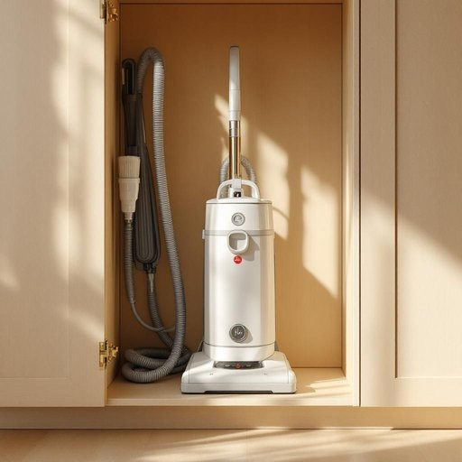

# hoover

<h1 style="font-size: 2.5em; font-weight: 300; letter-spacing: 2px; margin: 0; color: #2c3e50;">
/ˈhuvər/
</h1>

---

---

## 例句

Could you please bring the hoover from the cupboard downstairs, the one with the long cord and those extra brushes that Dad bought last year, because I need to thoroughly clean the living room carpet before our guests arrive this afternoon?

*Could(/kʊd/) you(/ju/) please(/pliz/) bring(/brɪŋ/) the(/ðə/) hoover(/ˈhuvər/) from(/frəm/) the(/ðə/) cupboard(/ˈkəbərd/) downstairs,(/ˈdaʊnˈstɛrz,/) the(/ðə/) one(/wən/) with(/wɪθ/) the(/ðə/) long(/lɔŋ/) cord(/kɔrd/) and(/ənd/) those(/ðoʊz/) extra(/ˈɛkstrə/) brushes(/ˈbrəʃɪz/) that(/ðət/) Dad(/dæd/) bought(/bɔt/) last(/læst/) year,(/jɪr,/) because(/bɪˈkəz/) I(/aɪ/) need(/nid/) to(/tɪ/) thoroughly(/ˈθəroʊli/) clean(/klin/) the(/ðə/) living(/ˈlɪvɪŋ/) room(/rum/) carpet(/ˈkɑrpət/) before(/ˌbiˈfɔr/) our(/ɑr/) guests(/gɛsts/) arrive(/əraɪv/) this(/ðɪs/) afternoon?(/ˌæftərˈnun?/)*

**翻译：** 你能帮我从楼下柜子里拿吸尘器吗，就是那个带长电线的，还有爸爸去年买的备用刷头，因为我需要在今天下午客人到来之前，把客厅的地毯彻底清理干净。

---

## 解释

“hoover”作为名词在家居生活用品的语境中，指的是吸尘器，特别是在英国英语中较为常见。具体使用场合通常是在描述家庭清洁工具时，比如说“pass me the hoover”（把吸尘器递给我）。英语学习者需要注意的是，“hoover”作为名词时通常指具体的吸尘器设备，不同于动词用法（表示用吸尘器清扫），其复数形式为“hoovers”。常见搭配有“hoover cleaner”或直接称“hoover”，用法类似于“vacuum cleaner”，但“hoover”更口语化且地区性较强。该词的词源来自英国著名清洁电器品牌“Hoover”，最初是美国公司于20世纪初生产的吸尘器，因其广泛普及和市场影响力，“hoover”渐渐转变成了通用名词，成为吸尘器的代称，这种现象称为“品牌泛化”。在中文语境中，“hoover”准确的翻译是“吸尘器”，理解时应注意它并非专指某一品牌，而是泛指家庭用的吸尘机器。但需要指出的是，这一用法更多见于英式英语环境，在美式英语中普遍使用“vacuum cleaner”。此外，“hoover”作为名词一般没有褒贬含义，但因其品牌起源，偶尔在文化语境中也会被用来强调质量或专业性。

---

<small style="color: #999; font-size: 0.9em;">2025-07-27 09:14:04</small>

