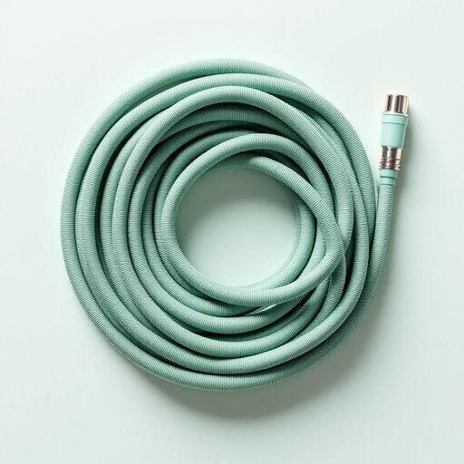

# hose

<h1 style="font-size: 2.5em; font-weight: 300; letter-spacing: 2px; margin: 0; color: #2c3e50;">
/hoʊz/
</h1>

---

---

## 例句

Could you please grab the green hose from the shed, which Dad bought last summer specifically because it’s supposed to be more durable and kink-resistant, so we can water the garden thoroughly before the forecasted rain arrives this evening?

*Could(/kʊd/) you(/ju/) please(/pliz/) grab(/græb/) the(/ðə/) green(/grin/) hose(/hoʊz/) from(/frəm/) the(/ðə/) shed,(/ʃɛd,/) which(/wɪʧ/) Dad(/dæd/) bought(/bɔt/) last(/læst/) summer(/ˈsəmər/) specifically(/spəˈsɪfɪkli/) because(/bɪˈkəz/) it’s(/it’s*/) supposed(/səˈpoʊzd/) to(/tɪ/) be(/bi/) more(/mɔr/) durable(/ˈdʊrəbəl/) and(/ənd/) kink-resistant,(/kink-resistant*,/) so(/soʊ/) we(/wi/) can(/kən/) water(/ˈwɔtər/) the(/ðə/) garden(/ˈgɑrdən/) thoroughly(/ˈθəroʊli/) before(/ˌbiˈfɔr/) the(/ðə/) forecasted(/ˈfɔrˌkæstɪd/) rain(/reɪn/) arrives(/əraɪvz/) this(/ðɪs/) evening?(/ˈivnɪŋ?/)*

**翻译：** 你能帮忙从工具棚里拿出那条爸爸去年夏天专门买的绿色水管吗？据说它更耐用，不易打结，这样我们就能在今晚预报的雨水到来前彻底浇灌花园。

---

## 解释

英语单词hose作为名词在家居生活用品场景中，通常指的是用于输送水或其他液体的软管，比如花园浇水软管（garden hose）。具体使用时，常见于家庭园艺、清洁、洗车等场合，比如water hose（水管）或garden hose表示花园里用的浇水软管。英语学习者在使用时需要注意的是，hose的复数形式也是hoses，且通常搭配动词如turn on/off the hose（打开/关闭软管）、connect the hose to the faucet（将软管连接到水龙头）等表达。另外，hose作为可数名词，指具体一条或几条软管，通常前面会有冠词或数量词修饰。在词源方面，hose一词源自古英语hosa，本义指覆盖腿部的布制或皮制护腿，后来引申为管状物，因其形状细长柔软，逐渐演变为指软管。中文语境中，hose准确翻译为软管或水管，强调其柔软且可弯曲的特点，与硬管（pipe）有所区别。需要注意的是，hose在现代英语中较为中性，无特殊褒贬含义或文化色彩，但在某些非正式口语中，hose有时作为动词表示欺骗、敲诈之意，但这与家居用品语境无关，不应混淆。总的来说，hose作为家居生活用品名词，指的是用于输水等目的的软管，是生活中常见且实用的词汇。

---

<small style="color: #999; font-size: 0.9em;">2025-07-27 09:14:04</small>

