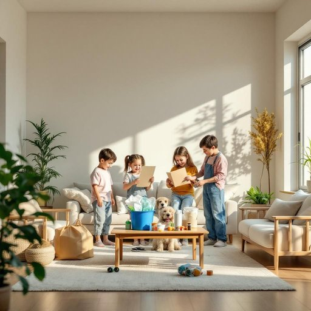

# household

<h1 style="font-size: 2.5em; font-weight: 300; letter-spacing: 2px; margin: 0; color: #2c3e50;">
/ˈhaʊsˌhoʊld/
</h1>

---

---

## 例句

In our household, which consists of four people including two children and a dog, we make a conscious effort to recycle not only paper and plastic but also household batteries and electronic waste, ensuring that every member understands the importance of sustainability in managing day-to-day living essentials.

*In(/ɪn/) our(/ɑr/) household,(/ˈhaʊsˌhoʊld,/) which(/wɪʧ/) consists(/kənˈsɪsts/) of(/əv/) four(/fɔr/) people(/ˈpipəl/) including(/ˌɪnˈkludɪŋ/) two(/tu/) children(/ˈʧɪldrən/) and(/ənd/) a(/ə/) dog,(/dɔg,/) we(/wi/) make(/meɪk/) a(/ə/) conscious(/ˈkɑnʃəs/) effort(/ˈɛfərt/) to(/tɪ/) recycle(/riˈsaɪkəl/) not(/nɑt/) only(/ˈoʊnli/) paper(/ˈpeɪpər/) and(/ənd/) plastic(/ˈplæstɪk/) but(/bət/) also(/ˈɔlsoʊ/) household(/ˈhaʊsˌhoʊld/) batteries(/ˈbætəriz/) and(/ənd/) electronic(/ˌɪˌlɛkˈtrɑnɪk/) waste,(/weɪst,/) ensuring(/ɪnˈʃʊrɪŋ/) that(/ðət/) every(/ˈɛvəri/) member(/ˈmɛmbər/) understands(/ˌəndərˈstændz/) the(/ðə/) importance(/ˌɪmˈpɔrtəns/) of(/əv/) sustainability(/səˌsteɪnəˈbɪlɪti/) in(/ɪn/) managing(/ˈmænəʤɪŋ/) day-to-day(/ˈdeɪtuˌdeɪ/) living(/ˈlɪvɪŋ/) essentials.(/ɛˈsɛnʃəlz./)*

**翻译：** 在我们家，共有四口人，包括两个孩子和一只狗。我们有意识地回收不仅是纸张和塑料，还有家用电池及电子废弃物，确保每个家庭成员都理解在日常生活必需品管理中可持续发展的重要性。

---

## 解释

英语单词“household”作为名词在家居生活用品场景中通常指一个家庭单位或居住在同一住所的全体成员，强调的是共同生活和经济活动的群体。具体使用场合多见于描述家庭中的人及其消费、支出、财务管理、生活方式等，如“household goods”（家用物品）、“household income”（家庭收入）等，常用于统计、市场调查或社会学研究中。英语学习者需要注意“household”作为名词时通常是单数形式，指一个整体单位，但语义上涉及多人；且常与复数名词搭配使用，如“a household of four”（四口之家）。此外，“household”也可以作形容词使用，表示“家庭的”，但在此讨论中着重其名词用法。词源上，“household”由“house”（房屋）和“hold”（掌控、拥有）组成，源自古英语，最初指一户人家及其家奴和物资，后来引申为现代家庭单位。中文语境中准确理解应为“家庭”或“家庭成员单位”，侧重生活共同体而非单独的房屋或个体，强调共同居住与生活的群体含义。该词本身无褒贬色彩，较为中性，在文化内涵上体现了对家庭结构和成员关系的整体认知，尤其在涉及家庭经济和消费领域时使用频繁。

---

<small style="color: #999; font-size: 0.9em;">2025-07-27 09:14:04</small>

