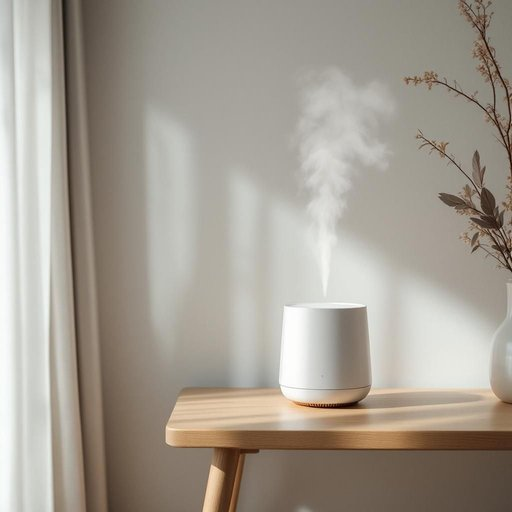

# humidifier

<h1 style="font-size: 2.5em; font-weight: 300; letter-spacing: 2px; margin: 0; color: #2c3e50;">
/hjuˈmɪdəˌfaɪər/
</h1>

---

---

## 例句

Since the air in our flat tends to get incredibly dry during the winter months, especially when the central heating is on for hours at a time, I decided to invest in a humidifier, which not only helps to maintain a comfortable level of moisture in the rooms but also reduces the static electricity that usually makes my hair frizzy and the wooden furniture prone to cracking.

*Since(/sɪns/) the(/ðə/) air(/ɛr/) in(/ɪn/) our(/ɑr/) flat(/flæt/) tends(/tɛndz/) to(/tɪ/) get(/gɪt/) incredibly(/ˌɪnˈkrɛdəbli/) dry(/draɪ/) during(/ˈdʊrɪŋ/) the(/ðə/) winter(/ˈwɪntər/) months,(/mənθs,/) especially(/əˈspɛʃəli/) when(/wɪn/) the(/ðə/) central(/ˈsɛntrəl/) heating(/ˈhitɪŋ/) is(/ɪz/) on(/ɔn/) for(/fər/) hours(/aʊərz/) at(/æt/) a(/ə/) time,(/taɪm,/) I(/aɪ/) decided(/ˌdɪˈsaɪdɪd/) to(/tɪ/) invest(/ˌɪnˈvɛst/) in(/ɪn/) a(/ə/) humidifier,(/hjuˈmɪdəˌfaɪər,/) which(/wɪʧ/) not(/nɑt/) only(/ˈoʊnli/) helps(/hɛlps/) to(/tɪ/) maintain(/meɪnˈteɪn/) a(/ə/) comfortable(/ˈkəmfərtəbəl/) level(/ˈlɛvəl/) of(/əv/) moisture(/ˈmɔɪsʧər/) in(/ɪn/) the(/ðə/) rooms(/rumz/) but(/bət/) also(/ˈɔlsoʊ/) reduces(/rɪˈdusɪz/) the(/ðə/) static(/ˈstætɪk/) electricity(/ɪˌlɛkˈtrɪsəti/) that(/ðət/) usually(/ˈjuʒəwəli/) makes(/meɪks/) my(/maɪ/) hair(/hɛr/) frizzy(/frizzy*/) and(/ənd/) the(/ðə/) wooden(/ˈwʊdən/) furniture(/ˈfərnɪʧər/) prone(/proʊn/) to(/tɪ/) cracking.(/ˈkrækɪŋ./)*

**翻译：** 由于我们公寓里的空气在冬季特别干燥，尤其是中央暖气长时间开启时，我决定购买一台加湿器，它不仅有助于维持室内适宜的湿度，还能减少静电，从而避免我的头发毛躁和木质家具因干裂而受损。

---

## 解释

“humidifier”作为名词，主要指一种家用电器，即“加湿器”，用于增加室内空气中的湿度，常见于干燥环境或冬季取暖时使用，以缓解空气干燥带来的不适，比如皮肤干裂、喉咙不适或呼吸道问题。英语学习者在使用“humidifier”时应注意该词为可数名词，通常与量词如“a”或数词连用，如a humidifier, two humidifiers，常见搭配有“run a humidifier”（开加湿器）、“use a humidifier to maintain humidity”（使用加湿器维持湿度）、“humidifier setting”（加湿器设置）等。该词由“humid”（潮湿的）与后缀“-ifier”（表示制造或产生某物的装置）合成，来自拉丁语“humidus”（湿润的）派生结合现代英语构词法，体现出该设备的功能本质。中文语境中，“humidifier”准确翻译为“加湿器”，是家居生活中重要的空气调节工具，其含义中性，无褒贬色彩或特殊文化隐喻，反映生活质量和健康维护的实用物品，使用时应结合具体语境提及功能或型号，以确保表达清晰准确。

---

<small style="color: #999; font-size: 0.9em;">2025-07-27 09:14:04</small>

