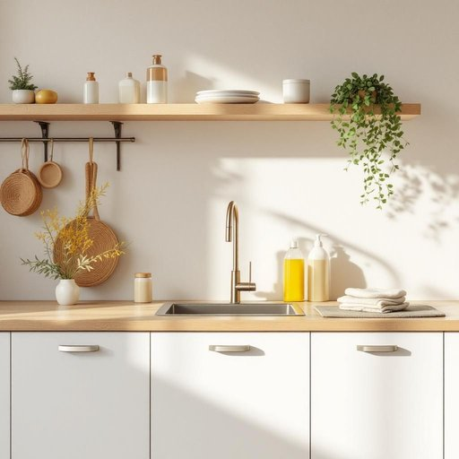

# hygiene

<h1 style="font-size: 2.5em; font-weight: 300; letter-spacing: 2px; margin: 0; color: #2c3e50;">
/ˈhaɪˌʤin/
</h1>

---

---

## 例句

Maintaining good hygiene, which includes regularly disinfecting kitchen surfaces, washing hands thoroughly before meals, and properly storing cleaning products out of children’s reach, is essential to preventing the spread of germs within the household.

*Maintaining(/meɪnˈteɪnɪŋ/) good(/gʊd/) hygiene,(/ˈhaɪˌʤin,/) which(/wɪʧ/) includes(/ˌɪnˈkludz/) regularly(/ˈrɛgjələrli/) disinfecting(/disinfecting*/) kitchen(/ˈkɪʧən/) surfaces,(/ˈsərfəsɪz,/) washing(/ˈwɑʃɪŋ/) hands(/hænz/) thoroughly(/ˈθəroʊli/) before(/ˌbiˈfɔr/) meals,(/milz,/) and(/ənd/) properly(/ˈprɑpərli/) storing(/ˈstɔrɪŋ/) cleaning(/ˈklinɪŋ/) products(/ˈprɑdəkts/) out(/aʊt/) of(/əv/) children’s(/children’s*/) reach,(/riʧ,/) is(/ɪz/) essential(/ɛˈsɛnʃəl/) to(/tɪ/) preventing(/prɪˈvɛnɪŋ/) the(/ðə/) spread(/sprɛd/) of(/əv/) germs(/ʤərmz/) within(/wɪˈθɪn/) the(/ðə/) household.(/ˈhaʊsˌhoʊld./)*

**翻译：** 保持良好的卫生习惯，包括定期消毒厨房表面、饭前彻底洗手以及妥善存放清洁用品，远离儿童触及，是防止家中细菌传播的关键。

---

## 解释

英语单词"hygiene"作为名词，在家居生活用品的语境中主要指保持清洁和健康的习惯或措施，如个人卫生（如洗手、刷牙）以及居家环境的清洁（如厨房卫生、清洁用品的使用等）。使用时，常见搭配有"personal hygiene"（个人卫生）、"oral hygiene"（口腔卫生）、"home hygiene"（家庭卫生）等，语法上通常作为不可数名词使用，不加复数形式，若要表示具体的卫生习惯或措施，常用定冠词the或形容词修饰。学习者应注意它通常不用于描述具体物品，而是指抽象的卫生概念或行为。词源上，"hygiene"源自希腊语"hygieinos"，意为“健康的”，得名于希腊健康与医药女神Hygeia，体现了与健康维护相关的文化内涵。在中文语境中，"hygiene"被准确翻译为“卫生”，尤其强调通过保持清洁而促进健康的行为或条件，含有积极、健康的褒义色彩，无贬义，并广泛应用于医学、公共健康及日常生活领域，是现代家庭生活不可或缺的概念。

---

<small style="color: #999; font-size: 0.9em;">2025-07-27 09:14:04</small>

