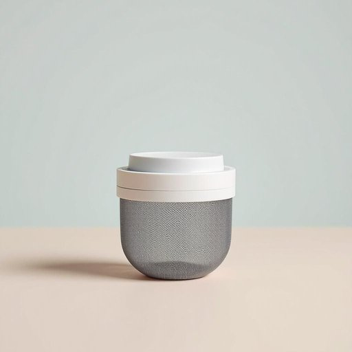

# infuser

<h1 style="font-size: 2.5em; font-weight: 300; letter-spacing: 2px; margin: 0; color: #2c3e50;">
/infuser*/
</h1>

---

---

## 例句

Could you please pass me the infuser that we bought last month, the one with the stainless steel mesh and silicone lid, because I want to brew some loose-leaf tea in the living room while I catch up on my reading and enjoy the rainy afternoon?

*Could(/kʊd/) you(/ju/) please(/pliz/) pass(/pæs/) me(/mi/) the(/ðə/) infuser(/infuser*/) that(/ðət/) we(/wi/) bought(/bɔt/) last(/læst/) month,(/mənθ,/) the(/ðə/) one(/wən/) with(/wɪθ/) the(/ðə/) stainless(/ˈsteɪnləs/) steel(/stil/) mesh(/mɛʃ/) and(/ənd/) silicone(/ˈsɪləˌkoʊn/) lid,(/lɪd,/) because(/bɪˈkəz/) I(/aɪ/) want(/wɔnt/) to(/tɪ/) brew(/bru/) some(/səm/) loose-leaf(/loose-leaf*/) tea(/ti/) in(/ɪn/) the(/ðə/) living(/ˈlɪvɪŋ/) room(/rum/) while(/waɪl/) I(/aɪ/) catch(/kæʧ/) up(/əp/) on(/ɔn/) my(/maɪ/) reading(/ˈrɛdɪŋ/) and(/ənd/) enjoy(/ˌɛnˈʤɔɪ/) the(/ðə/) rainy(/ˈreɪni/) afternoon?(/ˌæftərˈnun?/)*

**翻译：** 请把我们上个月买的那个茶叶冲泡器递给我，好吗？就是那个带不锈钢网和硅胶盖的，因为我想在客厅泡点散茶，一边看书，一边享受这雨后的午后时光。

---

## 解释

英语单词'infuser'作为名词在家居生活用品领域主要指用于泡茶、泡咖啡或其他饮品中，将茶叶、咖啡粉或草本植物等浸泡在热水中以提取风味的器具，常见于厨房或餐饮环境，如茶叶过滤器或咖啡滤器。使用时，英语学习者应注意其构成，'infuser'由动词'infuse'派生，表示“注入、浸泡”，作为可数名词时通常单数或复数形式，常用搭配包括'a tea infuser'（一个茶叶过滤器）、'a coffee infuser'等，表达时多与饮品、泡制过程搭配。语法上需注意这是一个具体物品的名称，不宜用作抽象概念。词源方面，'infuser'源自动词'infuse'，其拉丁根源为'infundere'，意为“倒入、注入”，词尾'-er'表示执行某动作的工具或人，合起来即“用于注入或浸泡物质的器具”。在中文语境中，'infuser'准确翻译为“茶叶过滤器”、“茶隔”或“泡茶器”，根据具体用途选择描述，强调其为便于将茶叶等与水分离的辅助用具，避免误解为冲泡整体茶具。该词无特殊褒贬色彩，属于中性物品名称，文化上在注重生活品质和茶文化的环境中使用较多，体现对饮品制作精细化与便利性的追求。

---

<small style="color: #999; font-size: 0.9em;">2025-07-27 09:14:04</small>

