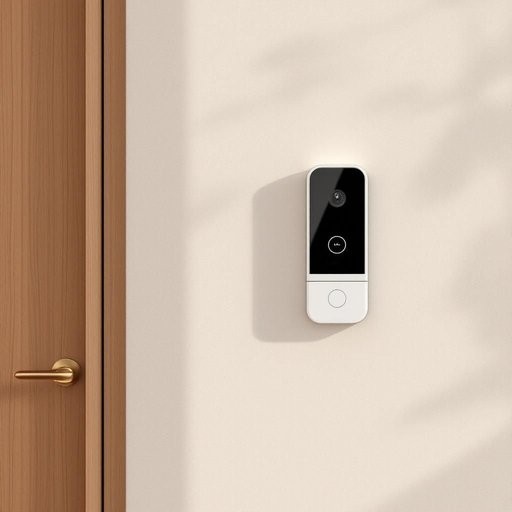

# intercom

<h1 style="font-size: 2.5em; font-weight: 300; letter-spacing: 2px; margin: 0; color: #2c3e50;">
/ˈɪntərˌkɑm/
</h1>

---

---

## 例句

The intercom, an essential device installed by the entrance, enabled me to communicate efficiently with visitors, ensuring security and convenience despite its somewhat outdated design.

*The(/ðə/) intercom,(/ˈɪntərˌkɑm,/) an(/ən/) essential(/ɛˈsɛnʃəl/) device(/dɪˈvaɪs/) installed(/ˌɪnˈstɔld/) by(/baɪ/) the(/ðə/) entrance,(/ˈɛntrəns,/) enabled(/ɪˈneɪbəld/) me(/mi/) to(/tɪ/) communicate(/kəmˈjunəˌkeɪt/) efficiently(/ɪˈfɪʃəntli/) with(/wɪθ/) visitors,(/ˈvɪzɪtərz,/) ensuring(/ɪnˈʃʊrɪŋ/) security(/sɪˈkjʊrəti/) and(/ənd/) convenience(/kənˈvinjəns/) despite(/dɪˈspaɪt/) its(/ɪts/) somewhat(/ˈsəmˈwət/) outdated(/ˈaʊtˌdeɪtɪd/) design.(/dɪˈzaɪn./)*

**翻译：** 门口安装的对讲机是一种必不可少的设备，虽然设计略显陈旧，但它使我能够高效地与访客交流，确保了安全与便利。

---

## 解释

单词“intercom”作为名词，主要指一种内部通讯设备，常见于家庭、办公楼或小区等场所，用于在不同房间或区域之间传递语音信息。在家居生活用品的语境中，intercom通常指安装在住宅内部的对讲机系统，方便家庭成员在室内各处进行即时沟通，比如门口的可视对讲机或房间间的语音连线设备。英语学习者在使用“intercom”时应注意，它是可数名词，常用表达包括“an intercom system”（一个对讲系统）、“use the intercom to talk”（用对讲机交谈）等，且通常与动词“use”、“install”（安装）、“call”（呼叫）搭配。该词来源于“inter-”（相互之间）和“communication”（通讯）的结合，体现了内部通信的功能。中文中，intercom常被译为“对讲机”或“内部对讲系统”，准确反映其作为室内或建筑内通讯工具的性质。此词在使用时没有褒贬色彩或特殊文化内涵，属于中性实用词汇，强调便捷的内部语音交流功能。

---

<small style="color: #999; font-size: 0.9em;">2025-07-27 09:14:04</small>

