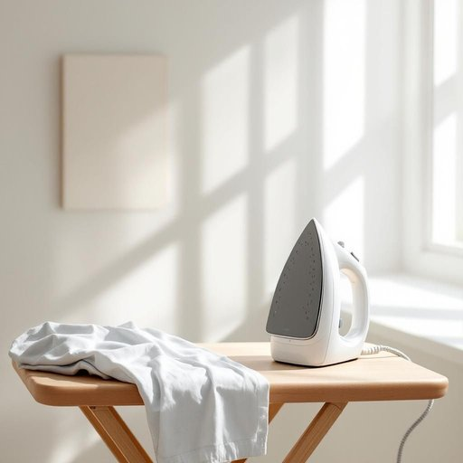

# iron

<h1 style="font-size: 2.5em; font-weight: 300; letter-spacing: 2px; margin: 0; color: #2c3e50;">
/aɪərn/
</h1>

---

---

## 例句

Could you please pass me the iron that's sitting on the board by the window, so I can quickly press this shirt before we leave for the dinner party, especially since the fabric tends to crease easily and looks quite untidy otherwise?

*Could(/kʊd/) you(/ju/) please(/pliz/) pass(/pæs/) me(/mi/) the(/ðə/) iron(/aɪərn/) that's(/ðæts/) sitting(/ˈsɪtɪŋ/) on(/ɔn/) the(/ðə/) board(/bɔrd/) by(/baɪ/) the(/ðə/) window,(/ˈwɪndoʊ,/) so(/soʊ/) I(/aɪ/) can(/kən/) quickly(/kˈwɪkli/) press(/prɛs/) this(/ðɪs/) shirt(/ʃərt/) before(/ˌbiˈfɔr/) we(/wi/) leave(/liv/) for(/fər/) the(/ðə/) dinner(/ˈdɪnər/) party,(/ˈpɑrti,/) especially(/əˈspɛʃəli/) since(/sɪns/) the(/ðə/) fabric(/ˈfæbrɪk/) tends(/tɛndz/) to(/tɪ/) crease(/kris/) easily(/ˈizəli/) and(/ənd/) looks(/lʊks/) quite(/kwaɪt/) untidy(/ənˈtaɪdi/) otherwise?(/ˈəðərˌwaɪz?/)*

**翻译：** 你能把窗边熨衣板上的熨斗递给我吗？我想趁我们去晚宴前赶紧把这件衬衫熨平，尤其是这面料容易起皱，否则看上去会很邋遢。

---

## 解释

英语单词“iron”在家居生活用品场景中作为名词，通常指“熨斗”，即用来熨平衣物褶皱的电器。具体使用场合多见于日常家务、洗衣、整理衣物等语境，如“put away the iron”（收起熨斗）、“use an iron to press the shirt”（用熨斗熨衬衫）。英语学习者在使用时应注意其可数名词性质，常见搭配有“an iron”（一把熨斗）、“a steam iron”（蒸汽熨斗）、“iron board”（熨衣板），也常用短语如“turn off the iron”（关闭熨斗），“heat up the iron”（加热熨斗）。此外，iron还可用作动词，表示“熨衣服”，如“iron clothes”。此词源于古英语“iren”或“isarn”，最初指金属铁质材料，后来因早期熨斗多由铁制成，逐渐引申为熨斗本身。在中文语境中，“iron”准确翻译为“熨斗”，与“铁”这种金属概念区分开来，避免混淆。该词在家居语境中无褒贬色彩，较为中性，文化上体现了家庭整洁与个人仪表的重视，是日常生活中常见且实用的小家电名称。

---

<small style="color: #999; font-size: 0.9em;">2025-07-27 09:14:04</small>

