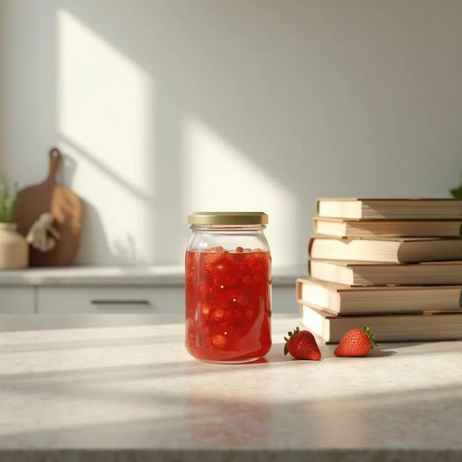

# jar

<h1 style="font-size: 2.5em; font-weight: 300; letter-spacing: 2px; margin: 0; color: #2c3e50;">
/ʤɑr/
</h1>

---

---

## 例句

Could you please pass me the jar of homemade strawberry jam that's sitting next to the stack of cookbooks on the kitchen counter, so I can spread some on my toast before we head out for the day?

*Could(/kʊd/) you(/ju/) please(/pliz/) pass(/pæs/) me(/mi/) the(/ðə/) jar(/ʤɑr/) of(/əv/) homemade(/ˈhoʊˈmeɪd/) strawberry(/ˈstrɔˌbɛri/) jam(/ʤæm/) that's(/ðæts/) sitting(/ˈsɪtɪŋ/) next(/nɛkst/) to(/tɪ/) the(/ðə/) stack(/stæk/) of(/əv/) cookbooks(/ˈkʊkˌbʊks/) on(/ɔn/) the(/ðə/) kitchen(/ˈkɪʧən/) counter,(/ˈkaʊntər,/) so(/soʊ/) I(/aɪ/) can(/kən/) spread(/sprɛd/) some(/səm/) on(/ɔn/) my(/maɪ/) toast(/toʊst/) before(/ˌbiˈfɔr/) we(/wi/) head(/hɛd/) out(/aʊt/) for(/fər/) the(/ðə/) day?(/deɪ?/)*

**翻译：** 你能把厨房台面上那叠烹饪书旁边的自制草莓酱罐子递给我吗？我想在出门前涂点儿在吐司上。

---

## 解释

jar作为名词在家居生活用品的语境中，通常指带有盖子的玻璃或陶瓷容器，用于储存食物如果酱、腌菜、调料等，常见于厨房场景。英语学习者使用jar时应注意，其通常是可数名词，复数形式为jars，且常与具体内容搭配，如a jar of honey（一罐蜂蜜）、a jar of pickles（一罐腌黄瓜），表达时常用of连接容器和内容物。此外，jar作为容器时一般指容量适中、带有密封盖的罐子，与bottle（瓶子）不同，瓶子多为带嘴且形状细长，罐子多呈圆柱形或略圆形。词源方面，jar源自中古英语jarre，可能来自古法语jarre，而其根源可能是源于拉丁语或阿拉伯语，反映了不同文化中对储存容器的命名习惯。在中文语境中，jar通常译为罐子或坛子，强调其密封性和用于食品储存的功能，翻译时应根据具体材质区分为玻璃罐或陶瓷坛，避免混淆为瓶子或瓶罐以保持准确理解。总体而言，jar作为家居用品名词没有特殊褒贬色彩，较为中性，日常生活中用法广泛，是表示家居食品储存容器的基本词汇之一。

---

<small style="color: #999; font-size: 0.9em;">2025-07-27 09:14:04</small>

