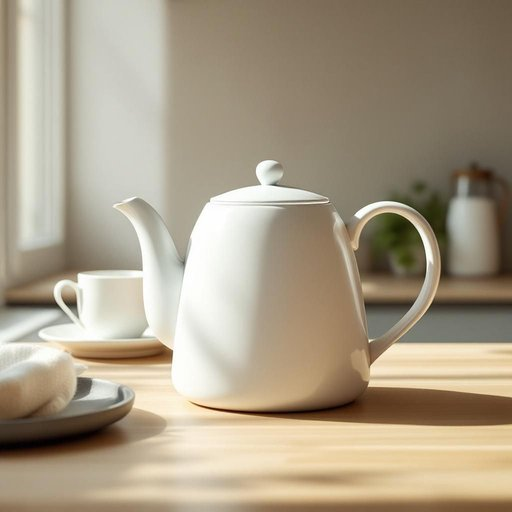

# jug

<h1 style="font-size: 2.5em; font-weight: 300; letter-spacing: 2px; margin: 0; color: #2c3e50;">
/ʤəg/
</h1>

---

---

## 例句

Could you please pass me the large ceramic jug that’s sitting next to the teapot on the kitchen counter, the one filled with fresh milk we usually use for guests, so I can pour some into my tea before we start our breakfast?

*Could(/kʊd/) you(/ju/) please(/pliz/) pass(/pæs/) me(/mi/) the(/ðə/) large(/lɑrʤ/) ceramic(/sərˈæmɪk/) jug(/ʤəg/) that’s(/that’s*/) sitting(/ˈsɪtɪŋ/) next(/nɛkst/) to(/tɪ/) the(/ðə/) teapot(/ˈtiˌpɑt/) on(/ɔn/) the(/ðə/) kitchen(/ˈkɪʧən/) counter,(/ˈkaʊntər,/) the(/ðə/) one(/wən/) filled(/fɪld/) with(/wɪθ/) fresh(/frɛʃ/) milk(/mɪlk/) we(/wi/) usually(/ˈjuʒəwəli/) use(/juz/) for(/fər/) guests,(/gɛsts,/) so(/soʊ/) I(/aɪ/) can(/kən/) pour(/pɔr/) some(/səm/) into(/ˈɪntu/) my(/maɪ/) tea(/ti/) before(/ˌbiˈfɔr/) we(/wi/) start(/stɑrt/) our(/ɑr/) breakfast?(/ˈbrɛkfəst?/)*

**翻译：** 你能把厨房台面上茶壶旁那个装满新鲜牛奶的大陶壶递给我吗？就是我们通常给客人用的那壶，我想在开始早餐前往茶里倒一些。

---

## 解释

英语单词“jug”作为名词在家居生活用品场景中，通常指一种带有手柄和嘴部用于倾倒液体的容器，如牛奶壶、水壶或果汁壶等，常见于厨房、餐厅或饮水场合。其具体使用情境包括盛装液体便于倒出，例如“a water jug”（水壶）、“a milk jug”（牛奶壶）等，适合描述容量较大且便于手持和倒水的容器。英语学习者使用“jug”时需注意其单数和复数形式分别为“jug”和“jugs”，一般作为可数名词出现，搭配的常见表达有“fill a jug with water”（往壶里装水）、“a jug of tea”（一壶茶）。同时，注意“jug”不能随意用来指极小的容器如杯子或瓶子。词源方面，“jug”一词起源于16世纪的英语俚语，原指装饮料用的瓷或陶器容器，可能来自中古英语“Jugge”，具体起源不甚明晰，但长期以来其含义保持相对稳定。中文中“jug”通常准确翻译为“壶”或“大壶”，强调其作为倒水或倒液体用具的功能，区别于“杯”、“瓶”等不同种类的容器。文化层面，“jug”一词较为中性，无明显褒贬色彩，但在某些英语方言或俚语中，“jug”可作为对监狱的俗称，学习时需结合上下文避免误用。综上，“jug”在日常家居生活中是指方便盛装并倾倒液体的大口壶，其使用需注意数的变化和正确的搭配用法，以准确表达和理解为原则。

---

<small style="color: #999; font-size: 0.9em;">2025-07-27 09:14:04</small>

