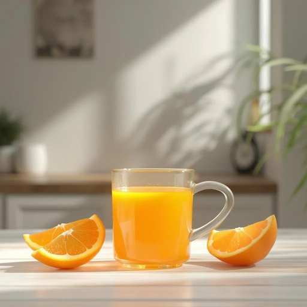

# juice

<h1 style="font-size: 2.5em; font-weight: 300; letter-spacing: 2px; margin: 0; color: #2c3e50;">
/ʤus/
</h1>

---

---

## 例句

Could you please pour me a glass of orange juice from the fridge while I finish tidying up the kitchen, since it's the only thing that really helps me wake up properly on these slow, rainy mornings at home?

*Could(/kʊd/) you(/ju/) please(/pliz/) pour(/pɔr/) me(/mi/) a(/ə/) glass(/glæs/) of(/əv/) orange(/ˈɔrɪnʤ/) juice(/ʤus/) from(/frəm/) the(/ðə/) fridge(/frɪʤ/) while(/waɪl/) I(/aɪ/) finish(/ˈfɪnɪʃ/) tidying(/tidying*/) up(/əp/) the(/ðə/) kitchen,(/ˈkɪʧən,/) since(/sɪns/) it's(/ɪts/) the(/ðə/) only(/ˈoʊnli/) thing(/θɪŋ/) that(/ðət/) really(/ˈrɪli/) helps(/hɛlps/) me(/mi/) wake(/weɪk/) up(/əp/) properly(/ˈprɑpərli/) on(/ɔn/) these(/ðiz/) slow,(/sloʊ,/) rainy(/ˈreɪni/) mornings(/ˈmɔrnɪŋz/) at(/æt/) home?(/hoʊm?/)*

**翻译：** 你能帮我从冰箱里倒杯橙汁吗？我想趁着整理厨房的时候喝一杯，因为在这些家里阴雨绵绵、清晨慵懒的时光里，只有它能真正帮我清醒过来。

---

## 解释

英语单词“juice”作为名词在家居生活用品的语境中，主要指各种水果或蔬菜榨取出来的液体饮料，如橙汁、苹果汁等，常见于厨房、餐桌或饮料柜等场合。英语学习者在使用“juice”时应注意其通常为不可数名词，表示一种液体，但在特定情境下也可作可数名词指一种果汁饮品的种类或瓶装单位，如“two juices”（两瓶果汁）；此外，“juice”常与水果名称搭配，如“orange juice”、“lemon juice”，以及与动词短语如“drink juice”（喝果汁）、“fresh juice”（鲜榨果汁）等表达组合使用。词源上，“juice”源自古法语“jus”，意指“汁液”或“液体”，其拉丁根源“jus”意为“汁液”或“汁水”，反映出果汁最初的自然流出物属性。在中文语境中，“juice”准确译为“果汁”或“蔬菜汁”，强调其天然榨取的液体形态，且通常与健康饮食、家庭饮品紧密相关，属于中性词汇，无褒贬含义。不过在某些俚语或口语中，“juice”亦可引申为“电力”或“权力”等，但在家居生活用品场景中无此用法，使用时需根据上下文准确理解。

---

<small style="color: #999; font-size: 0.9em;">2025-07-27 09:14:04</small>

