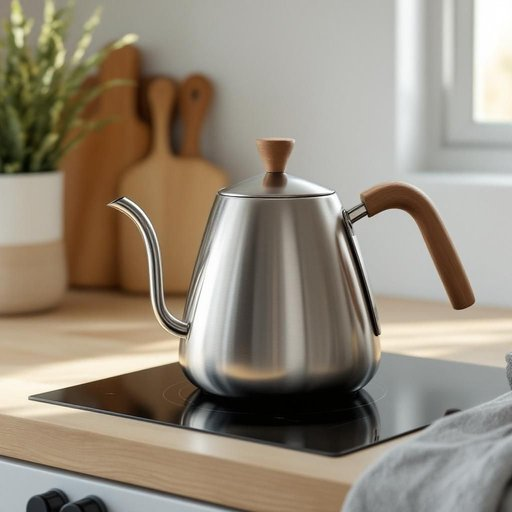

# kettle

<h1 style="font-size: 2.5em; font-weight: 300; letter-spacing: 2px; margin: 0; color: #2c3e50;">
/ˈkɛtəl/
</h1>

---

---

## 例句

Could you please fill the kettle with water and put it on the hob while I finish tidying up the kitchen, so that we have a nice, hot cup of tea ready as soon as you’re done?

*Could(/kʊd/) you(/ju/) please(/pliz/) fill(/fɪl/) the(/ðə/) kettle(/ˈkɛtəl/) with(/wɪθ/) water(/ˈwɔtər/) and(/ənd/) put(/pʊt/) it(/ɪt/) on(/ɔn/) the(/ðə/) hob(/hɑb/) while(/waɪl/) I(/aɪ/) finish(/ˈfɪnɪʃ/) tidying(/tidying*/) up(/əp/) the(/ðə/) kitchen,(/ˈkɪʧən,/) so(/soʊ/) that(/ðət/) we(/wi/) have(/hæv/) a(/ə/) nice,(/nis,/) hot(/hɑt/) cup(/kəp/) of(/əv/) tea(/ti/) ready(/ˈrɛdi/) as(/ɛz/) soon(/sun/) as(/ɛz/) you’re(/you’re*/) done?(/dən?/)*

**翻译：** 你能帮我把水壶注满水，放到炉子上烧着吗？我收拾厨房的时候，这样一来你一结束，我们就能马上享用一杯香浓的热茶了。

---

## 解释

英语单词"kettle"作为名词，在家居生活用品的语境中主要指用来烧水的壶，通常为金属制，配有壶口和壶盖，适用于炉灶或电加热，常见于厨房中，用以烧开饮用水或冲泡茶咖啡等。使用时，"kettle"多出现在描述日常生活情境，例如“boil the kettle”（烧开水壶里的水）、“put the kettle on”（烧开水壶）等表达。英语学习者需要注意的是，"kettle"为可数名词，复数形式为"kettles"，且常与动词"boil"搭配。此外，"kettle"还可用于比喻，比如“a kettle of fish”意为“棘手的事情，麻烦”，但主要在家居用品语境中无特殊褒贬色彩。词源上，"kettle"源自古英语"cytel"，根源可追溯至拉丁语"catillus"，意指浅盘或锅，反映了其作为烹饪器具的历史背景。在中文语境中，"kettle"准确翻译为“水壶”或“烧水壶”，强调其用于烧水的功能，与中文中茶壶、壶的范围有所区分，因此理解时应结合用途区分冷热饮器具。总体而言，"kettle"在家居用品中指明一种实用且普遍的厨房器具，表达清晰、无特殊文化负载，适合在日常生活和基本会话中广泛使用。

---

<small style="color: #999; font-size: 0.9em;">2025-07-27 09:14:04</small>

