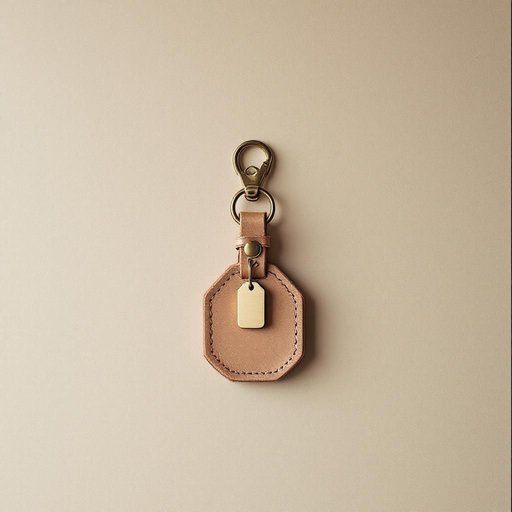

# key

<h1 style="font-size: 2.5em; font-weight: 300; letter-spacing: 2px; margin: 0; color: #2c3e50;">
/ki/
</h1>

---

---

## 例句

Before leaving the house, could you please make sure that the key, which has that small brass tag and is attached to the large, faded leather keyring, is safely tucked into your pocket so we don’t end up locked out again?

*Before(/ˌbiˈfɔr/) leaving(/ˈlivɪŋ/) the(/ðə/) house,(/haʊs,/) could(/kʊd/) you(/ju/) please(/pliz/) make(/meɪk/) sure(/ʃʊr/) that(/ðət/) the(/ðə/) key,(/ki,/) which(/wɪʧ/) has(/həz/) that(/ðət/) small(/smɔl/) brass(/bræs/) tag(/tæg/) and(/ənd/) is(/ɪz/) attached(/əˈtæʧt/) to(/tɪ/) the(/ðə/) large,(/lɑrʤ,/) faded(/ˈfeɪdɪd/) leather(/ˈlɛðər/) keyring,(/keyring*,/) is(/ɪz/) safely(/ˈseɪfli/) tucked(/təkt/) into(/ˈɪntu/) your(/jʊr/) pocket(/ˈpɑkət/) so(/soʊ/) we(/wi/) don’t(/don’t*/) end(/ɛnd/) up(/əp/) locked(/lɑkt/) out(/aʊt/) again?(/əˈgɛn?/)*

**翻译：** 在离开房子之前，麻烦请确认那把带有小黄铜标签、挂在那个大而褪色皮质钥匙扣上的钥匙已经妥善地放进了你的口袋，以免我们再次被锁在门外。

---

## 解释

英语单词“key”作为名词在家居生活用品的语境中，主要指开锁用的“钥匙”，这通常涉及门锁、抽屉锁或保险柜等需要物理解锁的场合。学习者需注意“key”作为可数名词使用时应注意单复数形式“key/keys”，以及搭配动词如“insert the key into the lock”（把钥匙插入锁中）、“turn the key”（转动钥匙）等常见用法。此外，“key”还常与“lock”搭配构成固定表达，例如“lock and key”表示用锁和钥匙的安全状态。“Key”一词源自古英语“cæg”，最早与锁和配套工具相关，体现其作为开启装置的重要功能。在中文语境中，“key”准确翻译为“钥匙”，强调其物理开锁的功能，无特殊褒贬色彩，但在文化中“钥匙”象征着开启和控制，因此在比喻意义上可能引申为“关键”或“方法”，不过在家居生活用品的语境中应聚焦于其字面含义。

---

<small style="color: #999; font-size: 0.9em;">2025-07-27 09:14:04</small>

