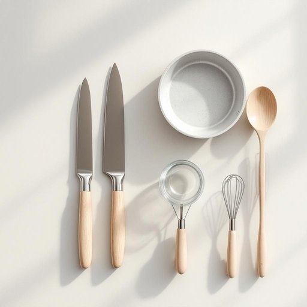

# kitchenware

<h1 style="font-size: 2.5em; font-weight: 300; letter-spacing: 2px; margin: 0; color: #2c3e50;">
/ˈkɪʧənˌwɛr/
</h1>

---

---

## 例句

Before we host the dinner party next weekend, could you please check if all the kitchenware, including the sharp knives, non-stick pans, and glass mixing bowls that Mum packed away last winter, are still clean and in good condition?

*Before(/ˌbiˈfɔr/) we(/wi/) host(/hoʊst/) the(/ðə/) dinner(/ˈdɪnər/) party(/ˈpɑrti/) next(/nɛkst/) weekend,(/ˈwiˌkɪnd,/) could(/kʊd/) you(/ju/) please(/pliz/) check(/ʧɛk/) if(/ɪf/) all(/ɔl/) the(/ðə/) kitchenware,(/ˈkɪʧənˌwɛr,/) including(/ˌɪnˈkludɪŋ/) the(/ðə/) sharp(/ʃɑrp/) knives,(/naɪvz,/) non-stick(/nɑnˈstɪk/) pans,(/pænz,/) and(/ənd/) glass(/glæs/) mixing(/ˈmɪksɪŋ/) bowls(/boʊlz/) that(/ðət/) Mum(/məm/) packed(/pækt/) away(/əˈweɪ/) last(/læst/) winter,(/ˈwɪntər,/) are(/ər/) still(/stɪl/) clean(/klin/) and(/ənd/) in(/ɪn/) good(/gʊd/) condition?(/kənˈdɪʃən?/)*

**翻译：** 在我们下周末举办晚宴之前，能否请你检查一下所有厨房用具，包括妈妈去年冬天收藏的锋利刀具、不粘锅和玻璃搅拌碗，确认它们是否依然干净且状况良好？

---

## 解释

英语单词"kitchenware"作为名词，指的是厨房用具或厨具，涵盖在厨房中用于烹饪、准备和盛放食品的各种器具和用品，如锅、碗、刀叉、烤盘等。一些具体的使用场合包括日常家庭烹饪、餐厅厨房操作、厨具商店的商品分类等语境。学习者在使用时需要注意这个词通常为不可数名词，表示一类物品的集合，因此一般不加复数形式，且多用作统称，搭配时常见表达有"buy kitchenware"（购买厨房用具）、"kitchenware shop"（厨具店）、"kitchenware set"（厨具套装）。该词由"kitchen"（厨房）和"ware"（器具、商品）组成，"ware"源自古英语"waru"，意指商品或器物，反映了此类词汇用于指代特定用途的物品的传统用法。在中文语境中，"kitchenware"准确翻译为“厨房用具”或“厨具”，具有中性且实用的意义，没有特殊褒贬或文化色彩，通常用以描述日常生活中与厨房相关的工具和用品，便于理解和使用。

---

<small style="color: #999; font-size: 0.9em;">2025-07-27 09:14:04</small>

