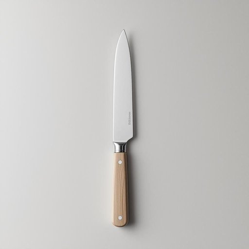

# knife

<h1 style="font-size: 2.5em; font-weight: 300; letter-spacing: 2px; margin: 0; color: #2c3e50;">
/naɪf/
</h1>

---

---

## 例句

Could you please pass me the knife that’s sharper and lighter than the one we usually keep in the drawer next to the chopping board so I can quickly slice through these tomatoes without squashing them?

*Could(/kʊd/) you(/ju/) please(/pliz/) pass(/pæs/) me(/mi/) the(/ðə/) knife(/naɪf/) that’s(/that’s*/) sharper(/ˈʃɑrpər/) and(/ənd/) lighter(/ˈlaɪtər/) than(/ðən/) the(/ðə/) one(/wən/) we(/wi/) usually(/ˈjuʒəwəli/) keep(/kip/) in(/ɪn/) the(/ðə/) drawer(/drɔr/) next(/nɛkst/) to(/tɪ/) the(/ðə/) chopping(/ˈʧɑpɪŋ/) board(/bɔrd/) so(/soʊ/) I(/aɪ/) can(/kən/) quickly(/kˈwɪkli/) slice(/slaɪs/) through(/θru/) these(/ðiz/) tomatoes(/təˈmɑtoʊz/) without(/wɪˈθaʊt/) squashing(/skˈwɑʃɪŋ/) them?(/ðɛm?/)*

**翻译：** 请把那把比我们平时放在砧板旁抽屉里的刀更锋利、更轻便的刀递给我，好让我能迅速切开这些番茄而不把它们压坏。

---

## 解释

英语单词"knife"在家居生活用品的语境中，作为名词主要指厨房或餐桌上用来切割食物的刀具，常用于切菜、切肉或切水果等具体场合，语境通常涉及烹饪、用餐或厨房工具的讨论。英语学习者使用该词时应注意其复数形式为"knives"，这是该词不规则的复数变化，同时在表示使用工具时常搭配动词"use"（使用）、"cut"（切）、"sharpen"（磨快）等，常见表达搭配有"a sharp knife"（一把锋利的刀）、"a kitchen knife"（厨房刀）、"a butter knife"（黄油刀）等。此外，"knife"还可用作动词，意为用刀刺或划，但在家居生活用品的语境中通常只作为名词使用。该词源自古英语"cnif"，其起源可以追溯到日耳曼语族，最初指利器刀刃，随着时间推移演变成现代英语中的"knife"，反映了日常生活切割工具的发展。中文里"knife"通常精准翻译为“刀”，强调其作为切割工具的功能，并在语境中根据具体形态细分为“菜刀”、“餐刀”等，但一般作为统称使用。这个词在日常用语中属于中性词，既无褒义也无贬义，文化上也非常普遍且实用，无特殊隐喻或负面含义，但在某些文学或影视作品中可能带有危险或暴力的象征性，因此需要根据上下文灵活理解。

---

<small style="color: #999; font-size: 0.9em;">2025-07-27 09:14:04</small>

