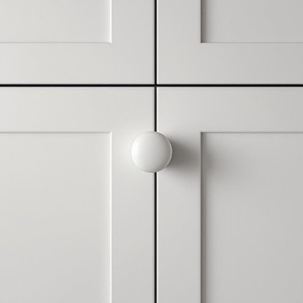

# knob

<h1 style="font-size: 2.5em; font-weight: 300; letter-spacing: 2px; margin: 0; color: #2c3e50;">
/nɑb/
</h1>

---

---

## 例句

Could you please tighten the loose knob on the kitchen cupboard door, which has been rattling every time the washing machine spins, before it falls off completely and causes any damage?

*Could(/kʊd/) you(/ju/) please(/pliz/) tighten(/ˈtaɪtən/) the(/ðə/) loose(/lus/) knob(/nɑb/) on(/ɔn/) the(/ðə/) kitchen(/ˈkɪʧən/) cupboard(/ˈkəbərd/) door,(/dɔr,/) which(/wɪʧ/) has(/həz/) been(/bɪn/) rattling(/ˈrætəlɪŋ/) every(/ˈɛvəri/) time(/taɪm/) the(/ðə/) washing(/ˈwɑʃɪŋ/) machine(/məˈʃin/) spins,(/spɪnz,/) before(/ˌbiˈfɔr/) it(/ɪt/) falls(/fɔlz/) off(/ɔf/) completely(/kəmˈplitli/) and(/ənd/) causes(/ˈkɔzɪz/) any(/ˈɛni/) damage?(/ˈdæmɪʤ?/)*

**翻译：** 请您帮忙拧紧厨房橱柜门上那个松动的旋钮，每次洗衣机甩干时它都会发出响声，以免它完全掉落并造成损坏。

---

## 解释

英语单词"knob"作为名词在家居生活用品的语境中，通常指门把手、旋钮或柜门上的圆形或椭圆形手柄，方便人们开关门窗或调节设备开关等。具体使用场合如开门、调整炉灶温度、音响设备音量旋钮等。英语学习者在使用该词时需注意，"knob"一般作为可数名词，常见搭配有“door knob”（门把手）、“cabinet knob”（柜门把手）、“volume knob”（音量旋钮）等，且常用于复数形式knobs描述多个旋钮或把手。该词可与动词“turn”搭配，如“turn the knob”表示“转动旋钮”。词源方面，"knob"源自中古英语knobbe，意指突出的小圆块，最初指树木、石头或物体上的小突起，后引申为任何形状类似的圆形把手或旋钮。中文语境中，"knob"准确的翻译为“旋钮”、“门把手”或“把手”，是一种功能性非常明确的家居用词，通常不带褒贬含义，也无特殊文化内涵，但在非正式英式英语口语中，“knob”有时带有轻微的贬义或作为俚语出现，表达对人的不满或轻蔑，这一点在家居用品语境中一般无需考虑。综上，"knob"在家居生活用品中即指物理上的旋钮或把手，是一个结构简洁、使用广泛的实用名词。

---

<small style="color: #999; font-size: 0.9em;">2025-07-27 09:14:04</small>

