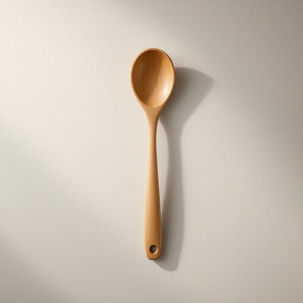

# ladle

<h1 style="font-size: 2.5em; font-weight: 300; letter-spacing: 2px; margin: 0; color: #2c3e50;">
/ˈleɪdəl/
</h1>

---

---

## 例句

Could you please hand me the ladle, which is usually kept in the utensil drawer next to the stove, so that I can carefully serve the homemade vegetable soup into the bowls without spilling a drop?

*Could(/kʊd/) you(/ju/) please(/pliz/) hand(/hænd/) me(/mi/) the(/ðə/) ladle,(/ˈleɪdəl,/) which(/wɪʧ/) is(/ɪz/) usually(/ˈjuʒəwəli/) kept(/kɛpt/) in(/ɪn/) the(/ðə/) utensil(/juˈtɛnsəl/) drawer(/drɔr/) next(/nɛkst/) to(/tɪ/) the(/ðə/) stove,(/stoʊv,/) so(/soʊ/) that(/ðət/) I(/aɪ/) can(/kən/) carefully(/ˈkɛrfəli/) serve(/sərv/) the(/ðə/) homemade(/ˈhoʊˈmeɪd/) vegetable(/ˈvɛʤtəbəl/) soup(/sup/) into(/ˈɪntu/) the(/ðə/) bowls(/boʊlz/) without(/wɪˈθaʊt/) spilling(/ˈspɪlɪŋ/) a(/ə/) drop?(/drɔp?/)*

**翻译：** 能否请你把那把通常放在炉灶旁厨具抽屉里的汤勺递给我，好让我小心翼翼地将自制的蔬菜汤盛进碗里，一滴不洒？

---

## 解释

英语单词“ladle”作为名词，在家居生活用品语境中指的是一种餐具，通常是带有长柄和深凹勺头的大勺子，专门用于盛取汤、酱汁或液体食物，常见于厨房或餐桌。使用时，“ladle”多出现在准备或分装汤品、炖菜、调味料等场合，例如“use a ladle to serve soup”（用汤勺舀汤），表达时可与动词“use”，“hold”，“pour”等搭配。语法上，作为可数名词，其复数形式为“ladles”，且在具体指单个或多把勺子时应注意数的对应。此外，英语学习者应注意“ladle”在句中常作宾语或状语出现，且多与具体操作动作连用以体现其功能性。该词源自古英语单词“hlædel”或“hlædel”意指舀取液体的工具，最初文字用法可追溯到中世纪，反映了厨房用具的传统形态和功能。中文语境中，“ladle”准确翻译为“汤勺”或“长柄勺”，强调其长柄和深形勺头的特征，便于舀取液体，区别于普通的汤匙或餐匙，没有褒贬含义，属于中性家庭厨房用具词汇，文化内涵主要体现在日常饮食和烹饪的功能性工具上，并无特殊的隐喻或情感色彩。

---

<small style="color: #999; font-size: 0.9em;">2025-07-27 09:14:04</small>

