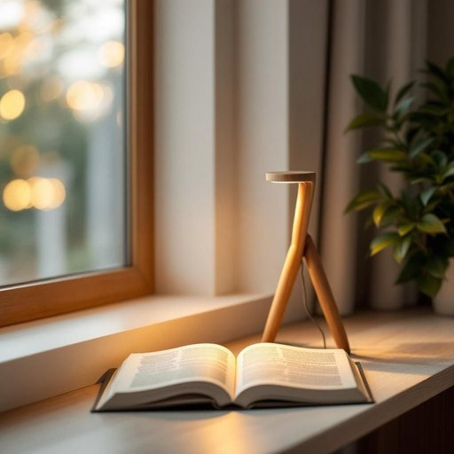

# lamp

<h1 style="font-size: 2.5em; font-weight: 300; letter-spacing: 2px; margin: 0; color: #2c3e50;">
/læmp/
</h1>

---

---

## 例句

Could you please move the lamp closer to the window, where the natural light is a bit weaker, so that I can read this book comfortably without straining my eyes in the evening?

*Could(/kʊd/) you(/ju/) please(/pliz/) move(/muv/) the(/ðə/) lamp(/læmp/) closer(/ˈkloʊzər/) to(/tɪ/) the(/ðə/) window,(/ˈwɪndoʊ,/) where(/wɛr/) the(/ðə/) natural(/ˈnæʧərəl/) light(/laɪt/) is(/ɪz/) a(/ə/) bit(/bɪt/) weaker,(/ˈwikər,/) so(/soʊ/) that(/ðət/) I(/aɪ/) can(/kən/) read(/rɛd/) this(/ðɪs/) book(/bʊk/) comfortably(/ˈkəmfərtəbli/) without(/wɪˈθaʊt/) straining(/ˈstreɪnɪŋ/) my(/maɪ/) eyes(/aɪz/) in(/ɪn/) the(/ðə/) evening?(/ˈivnɪŋ?/)*

**翻译：** 您能否将台灯移近窗户，那里的自然光稍显微弱，这样我晚上看书时就能更舒适地阅读，不用费眼睛了？

---

## 解释

英语单词“lamp”作为名词，在家居生活用品的语境中通常指带有灯泡和灯罩，用于照明的装置，如台灯、落地灯或壁灯，常见于卧室、客厅、书房等室内空间，使用场合包括阅读、工作、装饰或营造氛围等。学习者需要注意“lamp”通常作为可数名词使用，复数形式为“lamps”，且常与形容词连用，如“desk lamp”（台灯）、“floor lamp”（落地灯），以及与动词搭配表现开关动作，如“turn on/off the lamp”。此外，“lamp”在表达具体灯具时多指便携或小型灯具，而不包含整个照明系统或大型灯具。词源上，“lamp”源自希腊语“lampas”，意为火把，随着时间演变指用油或电力点亮的装置，反映了人类照明工具的发展历史。中文语境中，“lamp”准确翻译为“灯”或“台灯”等具体类型名称，强调其照明功能而非装饰本身，不带有特殊褒贬含义或文化色彩，但在不同语境下可与其他词组合表达更细致的家居照明用品。如在文学或日常口语中，“lamp”多为中性词，无特别情感色彩，仅指具体物品。

---

<small style="color: #999; font-size: 0.9em;">2025-07-27 09:14:04</small>

