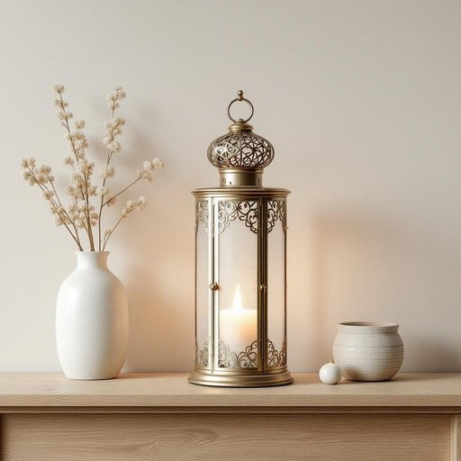

# lantern

<h1 style="font-size: 2.5em; font-weight: 300; letter-spacing: 2px; margin: 0; color: #2c3e50;">
/ˈlæntərn/
</h1>

---

---

## 例句

Could you please pass me that decorative lantern on the mantelpiece, the one with the intricate metalwork and frosted glass panels, so I can light a candle inside it and create a cosy atmosphere for tonight’s dinner party?

*Could(/kʊd/) you(/ju/) please(/pliz/) pass(/pæs/) me(/mi/) that(/ðət/) decorative(/ˈdɛkrətɪv/) lantern(/ˈlæntərn/) on(/ɔn/) the(/ðə/) mantelpiece,(/mantelpiece*,/) the(/ðə/) one(/wən/) with(/wɪθ/) the(/ðə/) intricate(/ˈɪntrəkət/) metalwork(/ˈmɛtəlˌwərk/) and(/ənd/) frosted(/ˈfrɔstɪd/) glass(/glæs/) panels,(/ˈpænəlz,/) so(/soʊ/) I(/aɪ/) can(/kən/) light(/laɪt/) a(/ə/) candle(/ˈkændəl/) inside(/ˌɪnˈsaɪd/) it(/ɪt/) and(/ənd/) create(/kriˈeɪt/) a(/ə/) cosy(/ˈkoʊzi/) atmosphere(/ˈætməsˌfɪr/) for(/fər/) tonight’s(/tonight’s*/) dinner(/ˈdɪnər/) party?(/ˈpɑrti?/)*

**翻译：** 你能把壁炉架上的那个装饰灯笼递给我吗？就是那个带有精致金属花纹和磨砂玻璃的，我想在里面点上一根蜡烛，为今晚的晚宴营造一个温馨的氛围。

---

## 解释

英语单词“lantern”作为名词在家居生活用品的语境中，通常指一种便携式的灯具，常见于需临时或户外照明的场合，如露营、庭院聚会或停电备用照明。它一般由灯罩（通常是玻璃或塑料）和保护框架组成，内部安装灯泡或蜡烛，用来提供柔和且分散的光线。学习者在使用“lantern”时应注意其为可数名词，复数形式为“lanterns”，前面可加不定冠词“a”或定冠词“the”，如“a lantern for camping”。常见搭配包括“carry a lantern”（提灯）、“decorate with lanterns”（用灯笼装饰）、“a battery-operated lantern”（电池驱动的灯笼）等。在表达技巧上，有时“lantern”强调便携和防护功能，区别于固定安装的“lamp”。词源方面，“lantern”来源于中古英语“lanterne”，进一步源自拉丁语“lanterna”，意指装有灯盏和灯罩的灯具，这与古代用以指明路径或信号的携带式灯有关。在中文语境中，“lantern”一般准确翻译为“灯笼”或“提灯”，但需区别于更具文化含义的传统“灯笼”，后者多指中国节日或装饰用的纸制灯具，而英文“lantern”涵盖更广泛的实用灯具概念，常见于现代便携式照明设备，无特殊褒贬含义，主要用于描述功能性照明工具，没有明显的文化色彩负担。

---

<small style="color: #999; font-size: 0.9em;">2025-07-27 09:14:04</small>

