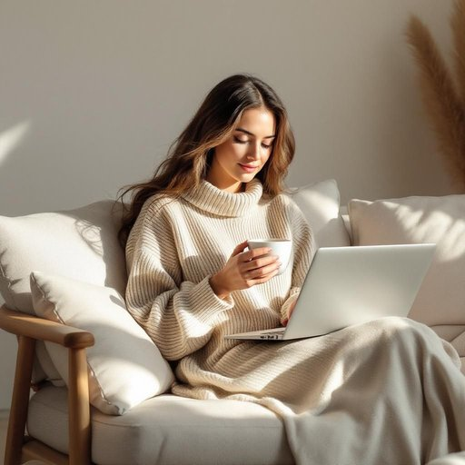

# laptop

<h1 style="font-size: 2.5em; font-weight: 300; letter-spacing: 2px; margin: 0; color: #2c3e50;">
/ˈlæpˌtɑp/
</h1>

---

---

## 例句

After finishing her morning chores, she curled up on the sofa with a cup of tea, eagerly opened her laptop—which she had painstakingly customised with ergonomic accessories and the latest software updates—to start writing the report due by the end of the day.

*After(/ˈæftər/) finishing(/ˈfɪnɪʃɪŋ/) her(/hər/) morning(/ˈmɔrnɪŋ/) chores,(/ʧɔrz,/) she(/ʃi/) curled(/kərld/) up(/əp/) on(/ɔn/) the(/ðə/) sofa(/ˈsoʊfə/) with(/wɪθ/) a(/ə/) cup(/kəp/) of(/əv/) tea,(/ti,/) eagerly(/ˈigərli/) opened(/ˈoʊpənd/) her(/hər/) laptop—which(/laptop—which*/) she(/ʃi/) had(/hæd/) painstakingly(/ˈpeɪnˌsteɪkɪŋli/) customised(/customised*/) with(/wɪθ/) ergonomic(/ˌərgəˈnɑmɪk/) accessories(/ækˈsɛsəriz/) and(/ənd/) the(/ðə/) latest(/ˈleɪtəst/) software(/ˈsɔfˌwɛr/) updates—to(/updates—to*/) start(/stɑrt/) writing(/ˈraɪtɪŋ/) the(/ðə/) report(/rɪˈpɔrt/) due(/du/) by(/baɪ/) the(/ðə/) end(/ɛnd/) of(/əv/) the(/ðə/) day.(/deɪ./)*

**翻译：** 完成早晨的家务后，她带着一杯茶舒适地蜷缩在沙发上，迫不及待地打开了笔记本电脑——这台电脑经过她精心定制，配备了符合人体工学的配件和最新的软件更新——开始撰写当天截止的报告。

---

## 解释

英语单词“laptop”作为名词，在家居生活用品的语境中指的是便携式个人电脑，通常体积小巧、重量轻，便于用户在家中任何地方如沙发、床上或桌边使用。具体使用场合包括居家办公、在线学习、娱乐休闲等，强调其便携性和灵活性。英语学习者使用“laptop”时需要注意，它是一个可数名词，单数形式为“laptop”，复数形式为“laptops”，常见搭配有“laptop computer”（笔记本电脑）、“laptop bag”（笔记本电脑包）、“laptop charger”（笔记本充电器）等，表达时通常与动词“use”、“carry”、“buy”等搭配。语法上无需特别复杂变化，但要注意其作为具体物品名词时的不定冠词使用，如“a laptop”。词源上，“laptop”源自英语词汇“lap”（膝盖）和“top”（顶部），意指可以放在膝盖上使用的电脑，体现了其设计的便携性和使用方便性。在中文语境中，“laptop”通常被准确翻译为“笔记本电脑”，这是一个标准且无歧义的译法，强调其轻便便携的特点，不带特殊褒贬色彩或文化内涵，属于现代电子产品的常用名词，广泛应用于家庭和办公场所。

---

<small style="color: #999; font-size: 0.9em;">2025-07-27 09:14:04</small>

