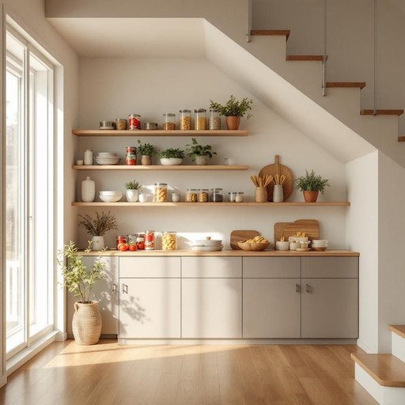

# larder

<h1 style="font-size: 2.5em; font-weight: 300; letter-spacing: 2px; margin: 0; color: #2c3e50;">
/ˈlɑrdər/
</h1>

---

---

## 例句

Before we start cooking dinner, could you please check the larder, which is the cool pantry tucked away under the stairs, to see if we have enough ingredients like canned tomatoes, dried herbs, and pasta, because I want to make sure we’re not missing anything essential for the recipe?

*Before(/ˌbiˈfɔr/) we(/wi/) start(/stɑrt/) cooking(/ˈkʊkɪŋ/) dinner,(/ˈdɪnər,/) could(/kʊd/) you(/ju/) please(/pliz/) check(/ʧɛk/) the(/ðə/) larder,(/ˈlɑrdər,/) which(/wɪʧ/) is(/ɪz/) the(/ðə/) cool(/kul/) pantry(/ˈpæntri/) tucked(/təkt/) away(/əˈweɪ/) under(/ˈəndər/) the(/ðə/) stairs,(/stɛrz,/) to(/tɪ/) see(/si/) if(/ɪf/) we(/wi/) have(/hæv/) enough(/ɪˈnəf/) ingredients(/ˌɪnˈgridiənts/) like(/laɪk/) canned(/kænd/) tomatoes,(/təˈmɑtoʊz,/) dried(/draɪd/) herbs,(/ərbz,/) and(/ənd/) pasta,(/ˈpɑstə,/) because(/bɪˈkəz/) I(/aɪ/) want(/wɔnt/) to(/tɪ/) make(/meɪk/) sure(/ʃʊr/) we’re(/we’re*/) not(/nɑt/) missing(/ˈmɪsɪŋ/) anything(/ˈɛniˌθɪŋ/) essential(/ɛˈsɛnʃəl/) for(/fər/) the(/ðə/) recipe?(/ˈrɛsəpi?/)*

**翻译：** 在我们开始做晚饭之前，你能否帮忙查看一下储藏室？那个藏在楼梯下的凉爽储藏室，看看我们是否有足够的食材，比如罐装西红柿、干香草和意大利面，因为我想确认我们没有遗漏任何食谱中必需的材料。

---

## 解释

英语单词“larder”作为名词，主要指家中用于储存食物的储藏室或食品间，通常比较冷凉且通风良好，适合保存蔬菜、肉类、乳制品等易腐食品。具体使用场合多出现在谈论传统或较大住宅的厨房配置，或者描述食物储藏管理时，如“put the vegetables in the larder”表示把蔬菜放进储藏室。英语学习者使用该词时应注意“larder”是可数名词，常见搭配有“the larder door”（储藏室门）、“stock the larder”（储备储藏室）、“empty larder”（空的储藏室）等，可与动词“stock”、“empty”、“search”等搭配。语法上一般作为具体名词使用，前面常用定冠词“the”或不定冠词“a”，复数形式为“larders”，但日常用复数不多。词源上，该词源于中古英语，最早来自古法语“lardier”，指存放咸猪肉（lard）的地方，而“lard”本身意为猪油，故最初含义即为专门储存猪油或肉类的储藏间，体现了欧洲传统家庭食品储存方式。中文语境中“larder”一般准确翻译为“食品储藏室”或“食物储藏间”，在现代家庭中常对应“食品柜”或“小厨房储物间”，但不同于普通“橱柜”或“食品柜台”，更侧重于专门存放食材的空间。此词在英国英语中较为常见，带有一定传统色彩，现代美式英语中更常用“pantry”，使用“larder”在日常口语中显得稍显正式或古典，无褒贬意义，仅反映出家庭生活中食物储存的具体环境和文化习惯。

---

<small style="color: #999; font-size: 0.9em;">2025-07-27 09:14:04</small>

