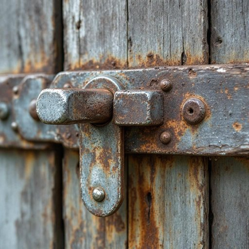

# latch

<h1 style="font-size: 2.5em; font-weight: 300; letter-spacing: 2px; margin: 0; color: #2c3e50;">
/læʧ/
</h1>

---

---

## 例句

The latch on the garden gate, which had been rusting and creaking loudly for weeks, finally gave way during the storm last night, allowing the wind to slam the door shut and wake everyone up.

*The(/ðə/) latch(/læʧ/) on(/ɔn/) the(/ðə/) garden(/ˈgɑrdən/) gate,(/geɪt,/) which(/wɪʧ/) had(/hæd/) been(/bɪn/) rusting(/ˈrəstɪŋ/) and(/ənd/) creaking(/ˈkrikɪŋ/) loudly(/ˈlaʊdli/) for(/fər/) weeks,(/wiks,/) finally(/ˈfaɪnəli/) gave(/geɪv/) way(/weɪ/) during(/ˈdʊrɪŋ/) the(/ðə/) storm(/stɔrm/) last(/læst/) night,(/naɪt,/) allowing(/əˈlaʊɪŋ/) the(/ðə/) wind(/wɪnd/) to(/tɪ/) slam(/slæm/) the(/ðə/) door(/dɔr/) shut(/ʃət/) and(/ənd/) wake(/weɪk/) everyone(/ˈɛvriˌwən/) up.(/əp./)*

**翻译：** 花园门上的门闩锈迹斑斑，吱吱作响，几周来一直如此，终于在昨夜的暴风雨中坏掉了，任由狂风猛地将门砰然关上，惊醒了所有人。

---

## 解释

英语单词‘latch’作为名词，在家居生活用品的语境中通常指门闩、插销或门锁中的一种机械装置，用于固定门窗，使其关闭且不易被随意打开。具体使用场合多见于描述门、窗、柜子等需要关闭和固定的家居物品，比如“door latch”（门闩）、“window latch”（窗闩）。英语学习者在使用‘latch’时应注意它作为名词通常指具体的锁扣装置，可与动词“release”（释放）、“engage”（扣上）、“secure”（固定）等搭配，表达开锁或锁紧的动作。此外，‘latch’也常与形容词连用，如“metal latch”（金属门闩）、“secure latch”（安全闩锁）。语法上，‘latch’作为可数名词，复数形式为‘latches’，表示多个门闩。词源方面，‘latch’来源于中古英语‘lacchen’，本意是抓住或扣紧，与古英语‘læccan’有关，体现了其固定物体的功能。中文语境中，‘latch’准确翻译为“门闩”或“插销”，强调的是机械装置用来保持门窗关闭的功能，不同于复杂的锁具（lock），更多是简易的固定装置。该词本身无明显褒贬色彩，属于中性词，但在实际使用中其安全性和便利性可能受到关注，尤其在家庭安全讨论中可能提及门闩的稳固性或易用性。总之，‘latch’作为名词在家居生活中主要指门窗等上的机械固定装置，是理解和描述家居安全设施时的重要词汇。

---

<small style="color: #999; font-size: 0.9em;">2025-07-27 09:14:04</small>

