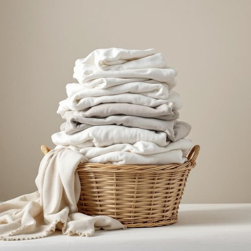

# laundry

<h1 style="font-size: 2.5em; font-weight: 300; letter-spacing: 2px; margin: 0; color: #2c3e50;">
/ˈlɔndri/
</h1>

---

---

## 例句

After a long week filled with back-to-back meetings and unexpected visitors, she finally decided to tackle the towering pile of laundry—consisting of everything from delicate silk blouses that required hand-washing to heavy-duty gym wear that had been sitting unattended in the basket for days—hoping to get everything sorted before the weekend.

*After(/ˈæftər/) a(/ə/) long(/lɔŋ/) week(/wik/) filled(/fɪld/) with(/wɪθ/) back-to-back(/back-to-back*/) meetings(/ˈmitɪŋz/) and(/ənd/) unexpected(/ˌənɪkˈspɛktɪd/) visitors,(/ˈvɪzɪtərz,/) she(/ʃi/) finally(/ˈfaɪnəli/) decided(/ˌdɪˈsaɪdɪd/) to(/tɪ/) tackle(/ˈtækəl/) the(/ðə/) towering(/ˈtaʊrɪŋ/) pile(/paɪl/) of(/əv/) laundry—consisting(/laundry—consisting*/) of(/əv/) everything(/ˈɛvriˌθɪŋ/) from(/frəm/) delicate(/ˈdɛləkət/) silk(/sɪlk/) blouses(/ˈblaʊsɪz/) that(/ðət/) required(/rikˈwaɪərd/) hand-washing(/hand-washing*/) to(/tɪ/) heavy-duty(/heavy-duty*/) gym(/ʤɪm/) wear(/wɛr/) that(/ðət/) had(/hæd/) been(/bɪn/) sitting(/ˈsɪtɪŋ/) unattended(/ənəˈtɛndɪd/) in(/ɪn/) the(/ðə/) basket(/ˈbæskət/) for(/fər/) days—hoping(/days—hoping*/) to(/tɪ/) get(/gɪt/) everything(/ˈɛvriˌθɪŋ/) sorted(/ˈsɔrtɪd/) before(/ˌbiˈfɔr/) the(/ðə/) weekend.(/ˈwiˌkɪnd./)*

**翻译：** 经过一周连轴转的会议和频繁的意外访客后，她终于决定着手清理那座高高堆积的衣物——从需要手洗的精致丝绸衬衫，到在篮子里放置多日未理的厚重健身服——希望在周末来临之前将一切整理妥当。

---

## 解释

英语单词laundry作为名词，在家居生活用品语境中主要指代需要清洗的衣物、床单等织物，也可以指洗衣房或洗衣服这一行为的场所或过程。具体使用场合通常包括家庭环境中提到待洗或刚洗好的衣物，如do the laundry（洗衣服），a pile of laundry（一堆待洗衣物），以及指代专门洗衣的地方，如laundry room（洗衣房）。学习者在使用laundry时需注意其通常不可数用来指洗衣物这一概念，但在表示待洗的衣物时也可用作复数形式laundries，不过较少见且偏正式；此外，laundry在搭配方面常与动词do、wash、hang、fold等连用，固定短语如laundry detergent（洗衣液/粉）和laundry basket（洗衣篮）较为常见。这个词源自中古英语lavendre，进而来自古法语lavanderie，其根源在拉丁语lavare，意为洗，反映了洗涤的含义和历史背景。在中文语境中，laundry通常准确翻译为洗衣物或洗衣，在指洗衣的场所时译为洗衣房或洗衣处，注意避免误译为单纯的洗衣服，以区分动作和实体名词。该词本身无褒贬含义，属于中性词，文化内涵上反映了家庭生活中日常琐事的普遍存在，亦关联到现代家务劳动和洗衣设备的发展，因而在表达日常家居管理和劳动分工时尤为常用。

---

<small style="color: #999; font-size: 0.9em;">2025-07-27 09:14:04</small>

