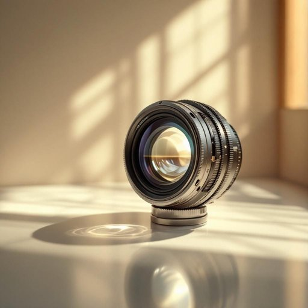

# lens

<h1 style="font-size: 2.5em; font-weight: 300; letter-spacing: 2px; margin: 0; color: #2c3e50;">
/lɛnz/
</h1>

---

---

## 例句

The intricate lens embedded within the antique camera, which had been meticulously crafted by a renowned optician in the 19th century, allows photographers to capture breathtaking images that reveal the subtle interplay of light and shadow, thus transforming ordinary scenes into extraordinary works of art.

*The(/ðə/) intricate(/ˈɪntrəkət/) lens(/lɛnz/) embedded(/ɛmˈbɛdɪd/) within(/wɪˈθɪn/) the(/ðə/) antique(/ænˈtik/) camera,(/ˈkæmərə,/) which(/wɪʧ/) had(/hæd/) been(/bɪn/) meticulously(/məˈtɪkjələsli/) crafted(/ˈkræftɪd/) by(/baɪ/) a(/ə/) renowned(/rɪˈnaʊnd/) optician(/ɑpˈtɪʃən/) in(/ɪn/) the(/ðə/) 19th(/19th*/) century,(/ˈsɛnʧəri,/) allows(/əˈlaʊz/) photographers(/fəˈtɑgrəfərz/) to(/tɪ/) capture(/ˈkæpʧər/) breathtaking(/ˈbrɛθˌteɪkɪŋ/) images(/ˈɪmɪʤɪz/) that(/ðət/) reveal(/rɪˈvil/) the(/ðə/) subtle(/ˈsətəl/) interplay(/ˈɪntərˌpleɪ/) of(/əv/) light(/laɪt/) and(/ənd/) shadow,(/ˈʃæˌdoʊ,/) thus(/ðəs/) transforming(/trænsˈfɔrmɪŋ/) ordinary(/ˈɔrdəˌnɛri/) scenes(/sinz/) into(/ˈɪntu/) extraordinary(/ˌɛkstrəˈɔrdəˌnɛri/) works(/wərks/) of(/əv/) art.(/ɑrt./)*

**翻译：** 这台古董相机内嵌的复杂镜头，由19世纪一位著名光学师精心打造，使摄影师能够捕捉到展现光影微妙交织的惊艳画面，从而将平凡的场景转化为非凡的艺术作品。

---

## 解释

英语单词“lens”作为名词，在家居生活用品的语境中主要指用于眼镜、照相机、显微镜等器件中的透镜，这些透镜通过折射光线实现聚焦或矫正视力等功能。具体使用场合包括描述眼镜片如“camera lens”（相机镜头）、“contact lens”（隐形眼镜）或显微镜、望远镜中的镜片。在语法上，“lens”通常作为可数名词使用，复数形式为“lenses”，英语学习者需注意其复数形式的正确拼写，且常见搭配包括“camera lens”（相机镜头）、“convex lens”（凸透镜）、“concave lens”（凹透镜）、“replace the lens”（更换镜片）等，表达时常涉及修饰该镜片功能或类型的形容词及其用途。词源方面，“lens”源自拉丁语“lenticularis”，意为“扁豆形”，因早期透镜形状类似扁豆状而得名，随着光学发展这一词义得到固定和广泛应用。从中文语境来看，“lens”准确对应“镜片”或“透镜”，在家居用品中通常指眼镜的片状部分或摄像设备中的镜头，区别于“镜子”（mirror）一词，二者不可混用。该词本身无褒贬色彩或特殊文化内涵，属于中性科技及生活用语，学习时应结合具体产品功能和场合理解使用，避免误用或泛化。

---

<small style="color: #999; font-size: 0.9em;">2025-07-27 09:14:04</small>

