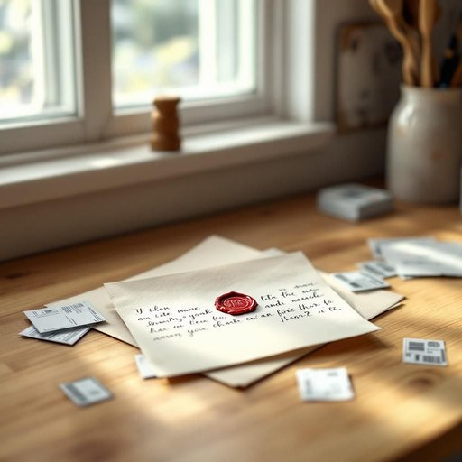

# letter

<h1 style="font-size: 2.5em; font-weight: 300; letter-spacing: 2px; margin: 0; color: #2c3e50;">
/ˈlɛtər/
</h1>

---

---

## 例句

While sorting through the pile of unopened mail on the kitchen counter, she noticed a letter, handwritten in elegant cursive and stamped with a wax seal, which looked distinctly different from the usual bills and advertisements that cluttered the hallway table.

*While(/waɪl/) sorting(/ˈsɔrtɪŋ/) through(/θru/) the(/ðə/) pile(/paɪl/) of(/əv/) unopened(/əˈnoʊpənd/) mail(/meɪl/) on(/ɔn/) the(/ðə/) kitchen(/ˈkɪʧən/) counter,(/ˈkaʊntər,/) she(/ʃi/) noticed(/ˈnoʊtɪst/) a(/ə/) letter,(/ˈlɛtər,/) handwritten(/ˈhænˌdrɪtən/) in(/ɪn/) elegant(/ˈɛləgənt/) cursive(/cursive*/) and(/ənd/) stamped(/stæmpt/) with(/wɪθ/) a(/ə/) wax(/wæks/) seal,(/sil,/) which(/wɪʧ/) looked(/lʊkt/) distinctly(/dɪˈstɪŋktli/) different(/ˈdɪfərənt/) from(/frəm/) the(/ðə/) usual(/ˈjuʒəwəl/) bills(/bɪlz/) and(/ənd/) advertisements(/ˈædvərˌtaɪzmənts/) that(/ðət/) cluttered(/ˈklətərd/) the(/ðə/) hallway(/ˈhɔlˌweɪ/) table.(/ˈteɪbəl./)*

**翻译：** 当她整理厨房柜台上那堆未拆阅的邮件时，注意到一封信，信上以优雅的连笔书写，盖有蜡封印章，显得与堆放在大厅桌上的那些账单和广告截然不同。

---

## 解释

英语单词letter作为名词在家居生活用品的语境中通常指寄发或收到的信件具体使用场合多见于家庭邮箱书桌信箱等场所涉及书信交流通信物品的收发与管理英语学习者需注意letter在语法上为可数名词常搭配动词有write a letter写信receive a letter收到信件send a letter寄信等此外常见短语如letter paper信纸letter envelope信封也是重要搭配词源上letter源自拉丁语littera意指字母或书写符号逐渐引申为通过书写传达信息的纸质信件这反映出其历史上与文字和书写密切相关的文化背景在中文语境中letter精准对应为信信件强调其作为书写通信工具的功能排除误解为字母的可能虽在口语或日常生活中letter本身无褒贬色彩但在不同场合信件可能带有私人情感正式通知或重要信息的文化内涵理解时需结合具体语境

---

<small style="color: #999; font-size: 0.9em;">2025-07-27 09:14:04</small>

