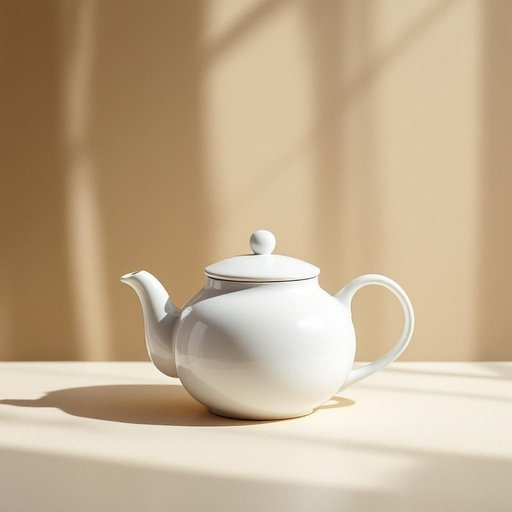

# lid

<h1 style="font-size: 2.5em; font-weight: 300; letter-spacing: 2px; margin: 0; color: #2c3e50;">
/lɪd/
</h1>

---

---

## 例句

Could you please ensure that the lid of the teapot is securely fastened before pouring the tea, as otherwise the hot liquid might spill and create a troublesome mess on the counter that would be difficult to clean up later?

*Could(/kʊd/) you(/ju/) please(/pliz/) ensure(/ɪnˈʃʊr/) that(/ðət/) the(/ðə/) lid(/lɪd/) of(/əv/) the(/ðə/) teapot(/ˈtiˌpɑt/) is(/ɪz/) securely(/sɪˈkjʊrli/) fastened(/ˈfæsənd/) before(/ˌbiˈfɔr/) pouring(/ˈpɔrɪŋ/) the(/ðə/) tea,(/ti,/) as(/ɛz/) otherwise(/ˈəðərˌwaɪz/) the(/ðə/) hot(/hɑt/) liquid(/ˈlɪkwɪd/) might(/maɪt/) spill(/spɪl/) and(/ənd/) create(/kriˈeɪt/) a(/ə/) troublesome(/ˈtrəbəlsəm/) mess(/mɛs/) on(/ɔn/) the(/ðə/) counter(/ˈkaʊntər/) that(/ðət/) would(/wʊd/) be(/bi/) difficult(/ˈdɪfəkəlt/) to(/tɪ/) clean(/klin/) up(/əp/) later?(/ˈleɪtər?/)*

**翻译：** 请您在倒茶前务必确认茶壶盖已牢固盖好，否则热茶可能会溢出，洒在台面上，不仅难以清理，还会带来诸多不便。

---

## 解释

英语单词lid作为名词在家居生活用品场景中主要指容器的盖子如锅盖罐盖瓶盖等通常用于覆盖和保护内部物品防止泄露蒸发或污染具体使用场合多见于厨房用具储物盒以及其他需要封闭的器皿中如pot lid锅盖jar lid罐子盖等对于英语学习者来说需要注意lid作为可数名词单复数形式是lidlids常见搭配包括put on the lid盖上盖子take off the lid取下盖子tighten the lid拧紧盖子等此外lid常与介词连用如lid on a pot锅上的盖子使用时要结合具体容器的名词词源上lid来源于中古英语可能源于古英语hlid意为覆盖物门其基本含义与现代意义相符即用于覆盖和保护中文语境中lid准确翻译为盖子这是一种功能性极强的物件且含义较为中性无特殊褒贬或文化色彩但在口语中有时也用作隐喻表示限制或控制但这并不常见于家居用品语境中总体来说lid是一个日常且基础的词汇强调物理覆盖的作用适合初中及以上英语学习者掌握和使用

---

<small style="color: #999; font-size: 0.9em;">2025-07-27 09:14:04</small>

